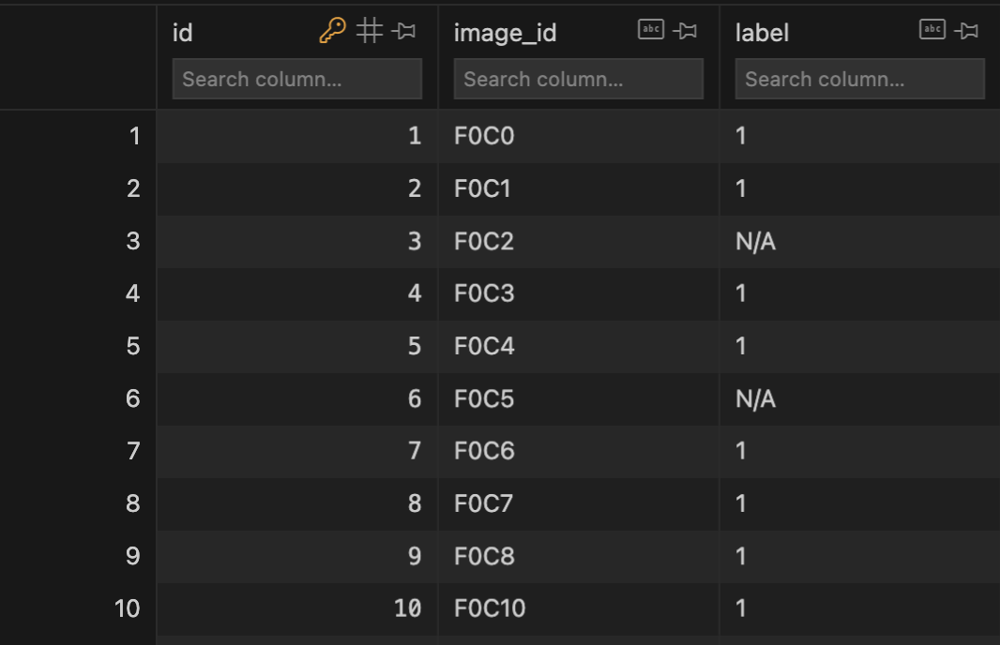

# ImageK4.0

Single-cell level image processing software.


## Usage
1. Go to the directory <b>OR</b> run imageK4.exe

```bach
cd ImageK4.0
python imagek4.py
```


2. Click "Select File" to choose file. (file ext must be .nd2/.tif)
3. Input parameters. 
    * Parameter 1 : int [0-255] -> Lower th for Canny algorithm.
    * Parameter 2 : int [Parameter 1-255] -> Higher th for Canny algorithm.
    * Image Size : int -> Size for square for each cell.
    * Mode -> "all" for general analysis including cell extraction, "Data Analysis" for only data analysis using existing database(.db), "Delete All" for clear unused files.
    * Layer Mode -> Dual (PH,Fluo1,Fluo2), Single(PH), Normal(PH,Fluo1)
4. Click "Run" to start the program.
5. Image labeling application window pops up when done with cell extraction.
6. Choose arbitrary label for each and press "Submit" or simply press Return key. (Default value is set to N/A)

7. Close the window when reached the last cell, then database will be automatically created.

## Database
### image_labels.db
Each cell ID has its manual_label from the application input.

### filename.db

Each cell(row) has values listed below.
* id : int -> unique ID
* cell_id : str -> cell id (Frame n Cell n)
* label_experiment : str | Null -> experimental label (e.g. Series1 exposure30min)
* manual_label : str | Null -> label data from image_labels.db with respect to cell ID 
* perimeter : float -> perimeter 
* area : float -> area 
* image_ph: BLOB -> PH image in Square block (image size x image size)
* iamge_flup1 : BLOB | Null -> Fluo 1 image
* iamge_flup2 : BLOB | Null -> Fluo 2 image
* contour: BLOB -> 2d array cell contour

## File Structure

- `imageK4.py`: Provides GUI and file selection features using tkinter.
- `main.py`: Central functionalities including image processing and data analysis.
- `nd2extract.py`: Data extraction from ND2 files.
- `app.py`: GUI part of the application using tkinter and SQLite.
- `calc_center.py`: Calculates the center of contours in images using OpenCV.
- `crop_contours.py`: Processes images to crop contours.
- `extract_tiff.py`: Extraction and processing of TIFF files.
- `image_process.py`: Integrates various custom modules for image processing.
- `initialize.py`: Initial setup for image processing.
- `unify_images.py`: Combines multiple images into a single output.

## License

[OpenCV License](https://github.com/opencv/opencv/blob/master/LICENSE)

## Contributors

- ikeda042

