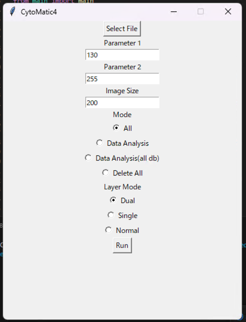
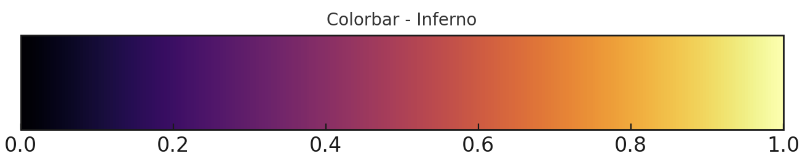

# CytoMatic4
CytoMatic4 is an OpenCV-based image processing program designed for automating the extraction of cell images from a large number of images (e.g., multiple nd2 files). This program is Python-based and utilizes Tkinter for its GUI, making it cross-platform. 

It has been primarily tested on Windows 10 and MacOS Sonoma 14.0.

# Installation 
1. Install python3.8 or higher on your computer.
2. Clone this repository to your computer. (e.g., on visual studio code)
3. Install the required packages with the following commmand in the root directory of the repository.
```bash
pip install -r requirements.txt
```

# Usage
1. Go to the directory and run cytomatic4.py <b>OR</b> run cytomatic4.exe

```bash
cd CytoMatic4
python3 cytomatic4.py
```



2. Click "Select File" to choose a file. (file ext must be .nd2/.tif)
3. Input parameters. 
    * Parameter 1 : int [0-255] ： Lower threshold for Canny algorithm.
    * Parameter 2 : int [Parameter 1-255] ： Higher threshold  for Canny algorithm.
    * Image Size : int ： Size for square for each cell.
    * Mode ： "all" for general analysis including cell extraction, "Data Analysis" for only data analysis using existing database(.db), "Delete All" to clear unused files.
    * Layer Mode -> Dual (PH,Fluo1,Fluo2), Single(PH), Normal(PH,Fluo1)
4. Click "Run" to start the program.
5. Image labeling application window pops up when done with cell extraction.
6. Choose arbitrary label for each and press "Submit" or simply press Return key. (Default value is set to N/A)

1. Close the window when reached the last cell, then database will automatically be created.

# Database
## image_labels.db
Each cell ID has its manual_label from the application input.

## filename.db

Each row (representing a cell) has the following values:
* id : int : unique ID
* cell_id : str : cell id (Frame n Cell n)
* label_experiment : str | Null : experimental label (e.g. Series1 exposure30min)
* manual_label : str | Null : label data from image_labels.db with respect to cell ID 
* perimeter : float : perimeter 
* area : float : area 
* image_ph: BLOB : PH image in Square block (image size x image size)
* image_flup1 : BLOB | Null : Fluo 1 image
* image_flup2 : BLOB | Null : Fluo 2 image
* contour: BLOB : 2d array cell contour

# File Structure

- `cytomatic4.py`: Provides GUI and file selection features using tkinter.
- `main.py`: Central functionalities including image processing and data analysis.
- `nd2extract.py`: Data extraction from ND2 files.
- `app.py`: GUI part of the application using tkinter and SQLite.
- `calc_center.py`: Calculates the center of contours in images using OpenCV.
- `crop_contours.py`: Processes images to crop contours.
- `extract_tiff.py`: Extraction and processing of TIFF files.
- `image_process.py`: Integrates various custom modules for image processing.
- `initialize.py`: Initial setup for image processing.
- `unify_images.py`: Combines multiple images into a single output.

# Output Files/Folders
These folders are automatically created once the scripts start.
## ./TempData
**/app_data**

All detected cells are labeled with a Cell ID (e.g., F1C4) and stored in this folder. The cells are in the square of "Image Size". Note that invalid cells (e.g., misditected cells) are also stored here.

**Fluo1**

The entire image of each frame for Fluo1 is included.

**Fluo2**

The entire image of each frame for Fluo2 is included.

**PH**

The entire image of each frame for PH is included.

## ./ph_contours
This folder contains the entire images of each PH frame with detected contours (in green) on the cells.

# Algorithms
## Cell Elongation Direction Determination Algorithm
### Objective:

To implement an algorithm for calculating the direction of cell elongation.

### Method: 

In this section, we consider the elongation direction determination algorithm with regard to the cell with contour shown in Fig.1 below. 

Scale bar is 20% of image size (200x200 pixel, 0.0625 µm/pixel)

<div align="center">

  

</div>

<p align="center">
Fig.1  <i>E.coli</i> cell with its contour (PH Left, Fluo-GFP Center, Fluo-mCherry Right)
</p>

Consider each contour coordinate as a set of vectors in a two-dimensional space:

$$\mathbf{X} = 
\left(\begin{matrix}
x_1&\cdots&x_n \\
y_1&\cdots&y_n 
\end{matrix}\right)^\mathrm{T}\in \mathbb{R}^{n\times 2}$$

The covariance matrix for $\mathbf{X}$ is:

$$\Sigma =
 \begin{pmatrix} V[\mathbf{X_1}]&Cov[\mathbf{X_1},\mathbf{X_2}]
 \\ 
 Cov[\mathbf{X_1},\mathbf{X_2}]& V[\mathbf{X_2}] \end{pmatrix}$$

where $\mathbf{X_1} = (x_1\:\cdots x_n)$, $\mathbf{X_2} = (y_1\:\cdots y_n)$.

Let's define a projection matrix for linear transformation $\mathbb{R}^2 \to \mathbb{R}$  as:

$$\mathbf{w} = \begin{pmatrix}w_1&w_2\end{pmatrix}^\mathrm{T}$$

Now the variance of the projected points to $\mathbb{R}$ is written as:
$$s^2 = \mathbf{w}^\mathrm{T}\Sigma \mathbf{w}$$

Assume that maximizing this variance corresponds to the cell's major axis, i.e., the direction of elongation, we consider the maximization problem of the above equation.

To prevent divergence of variance, the norm of the projection matrix is fixed at 1. Thus, solve the following constrained maximization problem to find the projection axis:

$$arg \max (\mathbf{w}^\mathrm{T}\Sigma \mathbf{w}), \|\mathbf{w}\| = 1$$


To solve this maximization problem under the given constraints, we employ the method of Lagrange multipliers. This technique introduces an auxiliary function, known as the Lagrange function, to find the extrema of a function subject to constraints. Below is the formulation of the Lagrange multipliers method as applied to the problem:

$$\cal{L}(\mathbf{w},\lambda) = \mathbf{w}^\mathrm{T}\Sigma \mathbf{w} - \lambda(\mathbf{w}^\mathrm{T}\mathbf{w}-1)$$

At maximum variance:
$$\frac{\partial\cal{L}}{\partial{\mathbf{w}}} = 2\Sigma\mathbf{w}-2\lambda\mathbf{w} = 0$$


Hence, 

$$ \Sigma\mathbf{w}=\lambda\mathbf{w} $$

Select the eigenvector corresponding to the eigenvalue where λ1 > λ2 as the direction of cell elongation.


### Result:

Figure 2 shows the raw image of an <i>E.coli </i> cell and the long axis calculated with the algorithm.

<div align="center">

  

</div>

<p align="center">
Fig.2  <i>E.coli</i> cell with its contour (PH Left, Replotted contour with the long axis Right)
</p>


## Basis conversion Algorithm
### Objective:

To implement an algorithm for replacing the basis of 2-dimentional space of the cell with the basis of the eigenspace(2-dimentional).

### Method:

Let 

$$ \mathbf{Q}  = \begin{pmatrix}
    v_1&v_2
\end{pmatrix}\in \mathbb{R}^{2\times 2}$$

$$\mathbf{\Lambda} = \begin{pmatrix}
    \lambda_1& 0 \\
    0&\lambda_2
\end{pmatrix}
(\lambda_1 > \lambda_2)$$

, then the spectral factorization of Cov matrix of the contour coordinates can be writtern as:

$$\Sigma =
 \begin{pmatrix} V[\mathbf{X_1}]&Cov[\mathbf{X_1},\mathbf{X_2}]
 \\ 
 Cov[\mathbf{X_1},\mathbf{X_2}]& V[\mathbf{X_2}] \end{pmatrix} = \mathbf{Q}\mathbf{\Lambda}\mathbf{Q}^\mathrm{T}$$

Hence, arbitrary coordinates in the new basis of the eigenbectors can be written as:

$$\begin{pmatrix}
    u_1&u_2
\end{pmatrix} = \mathbf{Q}^\mathrm{T}\begin{pmatrix}
    x_1&y_1
\end{pmatrix}$$


### Result:

Figure 3 shows contour in the new basis 

$$\begin{pmatrix}
    u_1&u_2
\end{pmatrix}$$ 


<div align="center">

  
</div>
<p align="center">
Fig.3  Each coordinate of contour in the new basis (Right). 
</p>


## Cell length calculation Algorithm
### Objective:

To implement an algorithm for calculating the cell length with respect to the center axis of the cell.

### Method:

<i>E.coli</i> expresses filamentous phenotype when exposed to certain chemicals. (e.g. Ciprofloxacin)

Figure 4 shows an example of a filamentous cell with Ciprofloxacin exposure. 

<div align="center">

  
</div>
<p align="center">
Fig.4 A filamentous <i>E.coli</i> cell (PH Left, Fluo-GFP Center, Fluo-mCherry Right).
</p>

Thus, the center axis of the cell, not necessarily straight, is required to calculate the cell length. 

Using the aforementioned basis conversion algorithm, first we converted the basis of the cell contour to its Cov matrix's eigenvectors' basis.

Figure 5 shows the coordinates of the contour in the new basis. 

<div align="center">

  
</div>
<p align="center">
Fig.5 The coordinates of the contour in the new basis (PH Left, contour in the new basis Right).
</p>

We then applied least aquare method to the coordinates of the contour in the new basis.

Let the contour in the new basis

$$\mathbf{C} = \begin{pmatrix}
    u_{1_1} &\cdots&\ u_{1_n} \\ 
    u_{2_1} &\cdots&\ u_{2_n} 
\end{pmatrix} \in \mathbb{R}^{2\times n}$$

then regression with arbitrary k-th degree polynomial (i.e. the center axis of the cell) can be expressed as:
$$f\hat{(u_1)} = \theta^\mathrm{T} \mathbf{U}$$

where 

$$\theta = \begin{pmatrix}
    \theta_k&\cdots&\theta_0
\end{pmatrix}^\mathrm{T}\in \mathbb{R}^{k+1}$$

$$\mathbf{U} = \begin{pmatrix}
    u_1^k&\cdots u_1^0
\end{pmatrix}^\mathrm{T}$$

the parameters in theta can be determined by normal equation:

$$\theta = (\mathbf{W}^\mathrm{T}\mathbf{W})^{-1}\mathbf{W}^\mathrm{T}\mathbf{f}$$

where

$$\mathbf{W} = \begin{pmatrix}
    u_{1_1}^k&\cdots&1 \\
     \vdots&\vdots&\vdots \\
     u_{1_n}^k&\cdots&1 
\end{pmatrix} \in \mathbb{R}^{n\times k +1}$$

$$\mathbf{f} = \begin{pmatrix}
    u_{2_1}&\cdots&u_{2_n}
\end{pmatrix}^\mathrm{T}$$

Hence, we have obtained the parameters in theta for the center axis of the cell in the new basis. (fig. 6)

Now using the axis, the arc length can be calculated as:

$$\mathbf{L} = \int_{u_{1_1}}^{u_{1_2}} \sqrt{1 + (\frac{d}{du_1}\theta^\mathrm{T}\mathbf{U})^2} du_1 $$

**The length is preserved in both bases.**

We rewrite the basis conversion process as:

$$\mathbf{U} = \mathbf{Q}^\mathbf{T} \mathbf{X}$$

The inner product of any vectors in the new basis $\in \mathbb{R}^2$ is 

$$ \|\mathbf{U}\|^2 = \mathbf{U}^\mathrm{T}\mathbf{U} = (\mathbf{Q}^\mathrm{T}\mathbf{X})^\mathrm{T}\mathbf{Q}^\mathbf{T}\mathbf{X} = \mathbf{X}^\mathrm{T}\mathbf{Q}\mathbf{Q}^\mathrm{T}\mathbf{X} \in \mathbb{R}$$

Since $\mathbf{Q}$ is an orthogonal matrix, 

$$\mathbf{Q}^\mathrm{T}\mathbf{Q} = \mathbf{Q}\mathbf{Q}^\mathrm{T} = \mathbf{I}$$

Thus, 

$$\|\mathbf{U}\|^2 = \|\mathbf{X}\|^2$$

Hence <u>the length is preserved in both bases.</u> 


### Result:

Figure 6 shows the center axis of the cell in the new basis (4-th polynominal).

<div align="center">

  
</div>
<p align="center">
Fig.6 The center axis of the contour in the new basis (PH Left, contour in the new basis with the center axis Right).
</p>

### Choosing the Appropriate K-Value for Polynomial Regression

By default, the K-value is set to 4 in polynomial regression. However, this may not be sufficient for accurately modeling "wriggling" cells.

For example, Figure 6-1 depicts a cell exhibiting extreme filamentous changes after exposure to Ciprofloxacin. The center axis as modeled does not adequately represent the cell's structure.

<div align="center">

  
</div>
<p align="center">
Fig.6-1  An extremely filamentous cell. (PH Left, contour in the new basis with the center axis Right).
</p>

The center axis (in red) with K = 4 does not fit as well as expected, indicating a need to explore higher K-values (i.e., K > 4) for better modeling.

Figure 6-2 demonstrates fit curves (the center axis) for K-values ranging from 5 to 10.

<div align="center">

  
</div>
<p align="center">
Fig.6-2: Fit curves for the center axis with varying K-values (5 to 10).
</p>

As shown in Fig. 6-2, K = 8 appears to be the optimal value. 

However, it's important to note that the differences in calculated arc lengths across various K-values fall within the subpixel range.

Consequently, choosing K = 4 might remain a viable compromise in any case.


# Data analysis

For data analysis, you are welcome to use your original scripts. (We provide how to connect to the database (i.e., *.db) in the different section.) 

However, you can also utilize the default scripts provided to review the cells you have labeled with the application.

The following *E.coli* cell in figure 7 is one of the output cells in the directory **"Cell/ph/"**.

<div align="center">

  
</div>

<p align="center">
Fig.7 A ph image of an <i>E.coli</i> cell.
</p>

## Output Folders/Files

### Cell/ph/

In this directory, the raw image(ph) of each cell with its contour(green) in the arbitrary set square is stored.  (e.g. fig.7)

The center of the cell is set to the center of the square.

### Cell/fluo1/
In this directory, the image(fluo1-channel) of each cell in the in the arbitrary set square is stored.

The center of the cell is set to the center of the square.

Figure 8 shows the fluo1 image of fig.7

<div align="center">

  
</div>

<p align="center">
Fig.8 A fluo1 image of the <i>E.coli</i> cell in fig.7.
</p>

### Cell/fluo1_incide_cell_only/

In this directory, only the cells(fluo1-channel) surrounded by the contour(red in fig.8) are stored.

The center of the cell is set to the center of the square.

Figure 9 shows areas inside the contour(red, fig.8).

<div align="center">

  
</div>

<p align="center">
Fig.9 Areas surrounded by the contour(red, fig.8).
</p>


### Cell/gradient_magnitudes/

In this directory, each image has the gradient information of the fluorescence intensities inside the cell calculated by the Sobel operator, plotted on the coordinates of the original cell pixels.

The center of the cell is set to the center of the square.

Figure 10 shows the plotted gradient information.

<div align="center">

  
</div>

<p align="center">
Fig.10 Calculated gradient at each pixel inside the cell.
</p>

### Cell/histo/
In this directory, histogram of the fluorescence intensities in 256 levels from 0 to 255 for each cell is stored. 

Figure 11 shows the histogram for the fluorescence information in fig.9.

<div align="center">

  
</div>

<p align="center">
Fig.11 Calculated gradient at each pixel inside the cell.
</p>

In this figure, the frequency at Fluo. intensity 255 is significantly different from the others. It means that the fluorescence information is saturated.

### Cell/histo_cumulative/
In this directory, a plotted cummulative freqency from Fluo. intensity 0  to 255 for each cell is stored.

Figure 12 shows the cumulative frequency plot for the cell.

<div align="center">

  
</div>

<p align="center">
Fig.12 Cumulative frequency plot for the cell.
</p>

### Cell/replot/

In this directory, the fluorescence information in each cell normalized between 0 and 1, is stored.
Note that the for the coordinates are in the new basis U.

Figure 13 shows the cumulative frequency plot for the cell.

<div align="center">

  
</div>

<p align="center">
Fig.13 Re-plotted fluo. information for the cell. 
</p>

The fluorescence information is normalized 0 to 1, then plotted with a colormap "inferno" as follows.

<div align="center">

  
</div>

# Quick Overview of the cells
After running the scripts in "data_analysis" mode, several .png files will be generated in the same directory as "cytomatic4.py".

Note that <u>"all" mode automatically includes this process.</u> so that you can directly check the results after running the processes.

In this section, we use "test_database.db" to demonstrate.


You can also run the scripts with the following commands to achieve the same results:

```bash
cd CytoMatic4
python3 demo.py
```
## PH
Displays all raw cells with their contours (in green) in a single image.

<div align="center">

  
</div>


## Fluo
Shows all raw fluorescent cells with their contours (in red) in a single image.
<div align="center">

  
</div>

## Replot 
Shows all the replot figures in a single image.
<div align="center">

  

</div>

## Histo
Shows all the histogram figures in a single image.

<div align="center">

  

</div>

## Histo Cumulative
Shows all the cumulative histogram figures in a single image.

<div align="center">

  

</div>


# License
[OpenCV License](https://github.com/opencv/opencv/blob/master/LICENSE)

# Contributors
- ikeda042 (Yunosuke Ikeda) b182587@hiroshima-u.ac.jp
