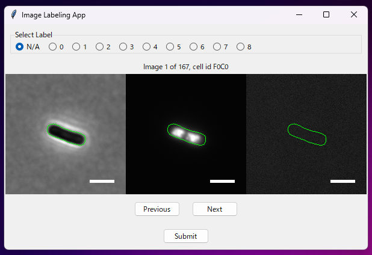

# ImageK4.0
## Usage
1. Go to the directory and run imageK4.py <b>OR</b> run imageK4.exe

```bach
cd ImageK4.0
python imagek4.py
```


2. Click "Select File" to choose file. (file ext must be .nd2/.tif)
3. Input parameters. 
    * Parameter 1 : int [0-255] -> Lower th for Canny algorithm.
    * Parameter 2 : int [Parameter 1-255] -> Higher th for Canny algorithm.
    * Image Size : int -> Size for square for each cell.
    * Mode -> "all" for general analysis including cell extraction, "Data Analysis" for only data analysis using existing database(.db), "Delete All" for clear unused files.
    * Layer Mode -> Dual (PH,Fluo1,Fluo2), Single(PH), Normal(PH,Fluo1)
4. Click "Run" to start the program.
5. Image labeling application window pops up when done with cell extraction.
6. Choose arbitrary label for each and press "Submit" or simply press Return key. (Default value is set to N/A)

7. Close the window when reached the last cell, then database will be automatically created.

## Database
### image_labels.db
Each cell ID has its manual_label from the application input.

### filename.db

Each cell(row) has values listed below.
* id : int -> unique ID
* cell_id : str -> cell id (Frame n Cell n)
* label_experiment : str | Null -> experimental label (e.g. Series1 exposure30min)
* manual_label : str | Null -> label data from image_labels.db with respect to cell ID 
* perimeter : float -> perimeter 
* area : float -> area 
* image_ph: BLOB -> PH image in Square block (image size x image size)
* iamge_flup1 : BLOB | Null -> Fluo 1 image
* iamge_flup2 : BLOB | Null -> Fluo 2 image
* contour: BLOB -> 2d array cell contour

## File Structure

- `imageK4.py`: Provides GUI and file selection features using tkinter.
- `main.py`: Central functionalities including image processing and data analysis.
- `nd2extract.py`: Data extraction from ND2 files.
- `app.py`: GUI part of the application using tkinter and SQLite.
- `calc_center.py`: Calculates the center of contours in images using OpenCV.
- `crop_contours.py`: Processes images to crop contours.
- `extract_tiff.py`: Extraction and processing of TIFF files.
- `image_process.py`: Integrates various custom modules for image processing.
- `initialize.py`: Initial setup for image processing.
- `unify_images.py`: Combines multiple images into a single output.

## Algorithms
### Cell Elongation Direction Determination Algorithm
**Objective:**

To implement an algorithm for calculating the direction of cell elongation.

**Method:** 

In this section, I consider the elongation direction determination algorithm with regard to the cell with contour shown in Fig.1 below. 

Scale bar is 20% of image size (200x200 pixel, 0.0625 µm/pixel)

<div align="center">

  

</div>

<p align="center">
Fig.1  <i>E.coli</i> cell with its contour (PH Left, Fluo-GFP Center, Fluo-mCherry Right)
</p>

Consider each contour coordinate as a set of points in a two-dimensional space:

$$\mathbf{X} = 
\left(\begin{matrix}
x_1&\cdots&x_n \\
y_1&\cdots&y_n 
\end{matrix}\right)^\mathrm{T}\in \mathbb{R}^{n\times 2}$$

The covariance matrix for $\mathbf{X}$ is:

$$\Sigma =
 \begin{pmatrix} V[\mathbf{X_1}]&Cov[\mathbf{X_1},\mathbf{X_2}]
 \\ 
 Cov[\mathbf{X_1},\mathbf{X_2}]& V[\mathbf{X_2}] \end{pmatrix}$$

where $\mathbf{X_1} = (x_1\:\cdots x_n)$, $\mathbf{X_2} = (y_1\:\cdots y_n)$.

Let's define the projection matrix for linear transformation $\mathbb{R}^2 \to \mathbb{R}$  as:

$$\mathbf{w} = \begin{pmatrix}w_1&w_2\end{pmatrix}^\mathrm{T}$$

Now the variance of the projected points to $\mathbb{R}$ is written as:
$$s^2 = \mathbf{w}^\mathrm{T}\Sigma \mathbf{w}$$

Assume that maximizing this variance corresponds to the cell's major axis, i.e., the direction of elongation, we consider the maximization problem of the above equation.

To prevent divergence of variance, the norm of the projection matrix is fixed at 1. Thus, solve the following constrained maximization problem to find the projection axis:

$$arg \max (\mathbf{w}^\mathrm{T}\Sigma \mathbf{w}), \|\mathbf{w}\| = 1$$


Using Lagrange multipliers:
$$\cal{L}(\mathbf{w},\lambda) = \mathbf{w}^\mathrm{T}\Sigma \mathbf{w} - \lambda(\mathbf{w}^\mathrm{T}\mathbf{w}-1)$$

At maximum variance:
$$\frac{\partial\cal{L}}{\partial{\mathbf{w}}} = 2\Sigma\mathbf{w}-2\lambda\mathbf{w} = 0$$


Hence, 

$$ \Sigma\mathbf{w}=\lambda\mathbf{w} $$

Select the eigenvector corresponding to the eigenvalue where λ1 > λ2 as the direction of cell elongnation.


**Result:**

Figure 2 shows the raw image of an <i>E.coli </i> cell and the long axis calculated with the algorithm.

<div align="center">

  

</div>

<p align="center">
Fig.2  <i>E.coli</i> cell with its contour (PH Left, Replotted contour with the long axis Right)
</p>


### Base conversion Algorithm
**Objective:**

To implement an algorithm for replacing the basis of 2-dimentional space of the cell with the basis of the eigenspace(2-dimentional).

**Method:** 

Let 

$$ \mathbf{Q}  = \begin{pmatrix}
    v_1&v_2
\end{pmatrix}$$

$$\mathbf{\Lambda} = \begin{pmatrix}
    \lambda_1& 0 \\
    0&\lambda_2
\end{pmatrix}
(\lambda_1 > \lambda_2)$$

, then the spectral factorization of Cov matrix of the contour coordinates can be writtern as:

$$\Sigma =
 \begin{pmatrix} V[\mathbf{X_1}]&Cov[\mathbf{X_1},\mathbf{X_2}]
 \\ 
 Cov[\mathbf{X_1},\mathbf{X_2}]& V[\mathbf{X_2}] \end{pmatrix} = \mathbf{Q}\mathbf{\Lambda}\mathbf{Q}^\mathrm{T}$$

Hence, arbitrary coordinates in the new basis of the eigenbectors can be written as:

$$\begin{pmatrix}
    u_1&u_2
\end{pmatrix} = \mathbf{Q}^\mathrm{T}\begin{pmatrix}
    x_1&y_1
\end{pmatrix}$$

Figure 3 shows contours in the new basis $\begin{pmatrix}u_1&u_2\end{pmatrix}$

<div align="center">

  

</div>

<p align="center">
Fig.3  Each coordinate of contours in the new basis. 
</p>


## License
[OpenCV License](https://github.com/opencv/opencv/blob/master/LICENSE)

## Contributors

- ikeda042

