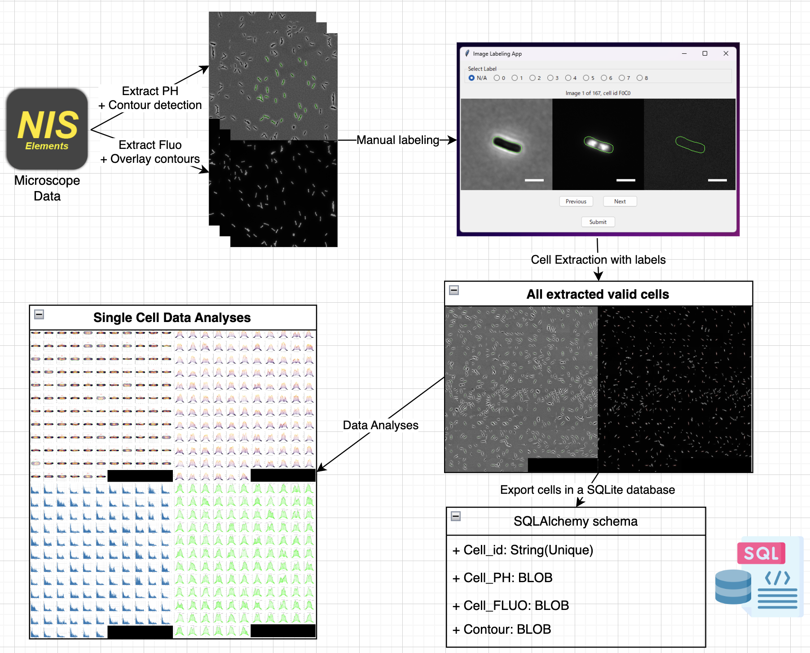
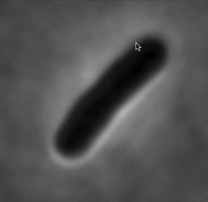

# PhenoPixel4.0

PhenoPixel4.0 is an OpenCV-based image processing program designed for automating the extraction of cell images from a large number of images (e.g., multiple nd2 files). 

It is also capable of detecting the contours of cells manually as shown so that all the phenotypic cells can be equally sampled.

This program is Python-based and utilizes Tkinter for its GUI, making it cross-platform. 

It has been primarily tested on Windows 11 and MacOS Sonoma 14.0.

