# PhenoPixel4.0

<div align="center">

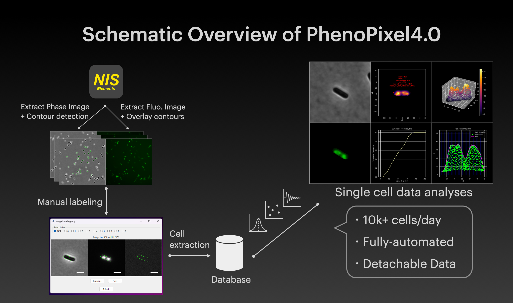

</div>
PhenoPixel4.0 is an OpenCV-based image processing program designed for automating the extraction of cell images from a large number of images (e.g., multiple nd2 files). 


10k+ cells can be sampled within a day with its rapid scanning system.
<div align="center">


</div>

It is also capable of detecting the contours of cells manually as shown so that all the phenotypic cells can be equally sampled.

<div align="center">

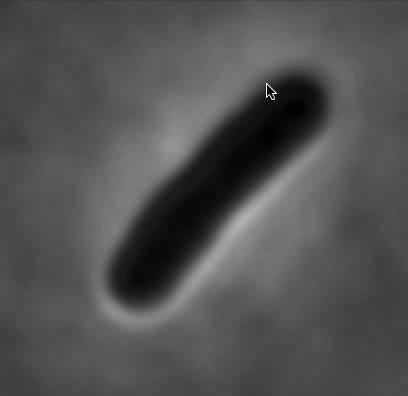

</div>


This program is Python-based and utilizes Tkinter for its GUI, making it cross-platform, and has been primarily tested on Windows 11 and MacOS Sonoma 14.0.

# Installation & Setup
1. Install `python 3.8` or higher on your computer.
2. Clone this repository to your computer. (e.g., on visual studio code)
```bash
https://github.com/ikeda042/PhenoPixel4.0.git
```
3. Install the required packages with the following commmand in the root directory of the repository.
```bash
pip install -r app/requirements.txt
```

# Usage
1. Go to the root directory and run `PhenoPixel4.py`
```bash
python PhenoPixel4.py
```
After running the scripts, the landing window automatically pops up. 

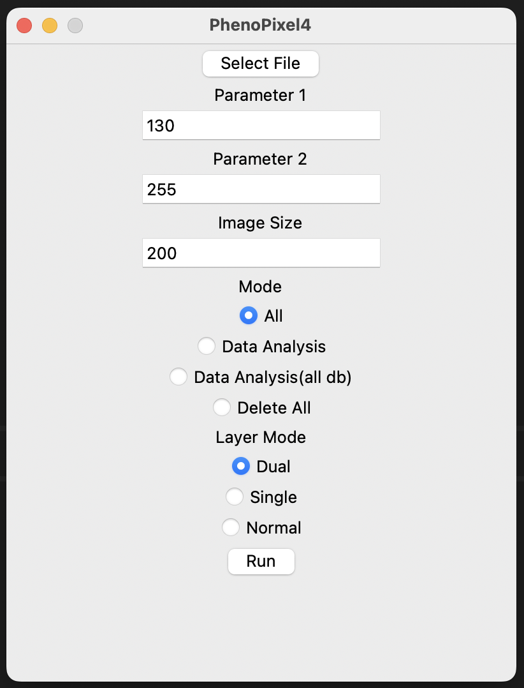

2. Click "Select File" to choose a file. (file ext must be .nd2/.tif)
   

Input parameters are listed below.

| Parameters  |    Type     | Description                                                                                                                                                                                                                                                                                                                |
| :---------: | :---------: | :------------------------------------------------------------------------------------------------------------------------------------------------------------------------------------------------------------------------------------------------------------------------------------------------------------------------- |
| Parameter 1 | int [0-255] | Lower threshold for Canny algorithm.                                                                                                                                                                                                                                                                                       |
| Parameter 2 | int [0-255] | Higher threshold for Canny algorithm.                                                                                                                                                                                                                                                                                      |
| Image Size  |     int     | Size of the squares for each cell.                                                                                                                                                                                                                                                                                         |
|    Mode     |   Literal   | `all` for general analysis including cell extraction, `Data Analysis` for only data analysis using existing database(.db),  `Data Analysis(all db)` for sequentially read all the databases in the root directly, and `Delete All` to clear unused files. `load stack file(beta)` Loading matlab stack file(experimental). |
| Layer Mode  |   Literal   | `Dual(PH,Fluo1,Fluo2)`/`Single(PH)`/`Normal(PH,Fluo1)`                                                                                                                                                                                                                                                                     |

For exmaple, if you have an nd2 file structured like PH_0, Fluo_0, PH_1, Fluo_1..., `Normal` Mode works the best.

3. Click "Run" to start the program.
4. Image labeling application window pops up when done with cell extraction.
5. Choose arbitrary label for each and press "Submit" or simply press Return key. (Default value is set to N/A) You can use the label later to analyse cells. (e.g., only picking up cells with label 1)
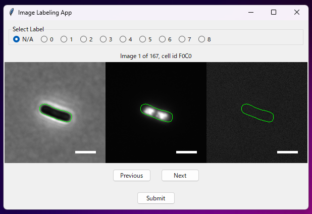
6. Close the window when reached the last cell, then database will automatically be created.

# Database
## image_labels.db

Each row has the following columns:

| Column Name | Data Type | Description                |
| ----------- | --------- | -------------------------- |
| id          | int       | Unique ID                  |
| image_id    | str       | Cell id                    |
| label       | str       | Label data manually chosen |

## filename.db
| Column Name      | Data Type    | Description                                             |
| ---------------- | ------------ | ------------------------------------------------------- |
| id               | int          | Unique ID                                               |
| cell_id          | str          | Cell id (Frame n Cell n)                                |
| label_experiment | str \| Null  | Experimental label (e.g., Series1 exposure30min)        |
| manual_label     | str \| Null  | Label data from image_labels.db with respect to cell ID |
| perimeter        | float        | Perimeter                                               |
| area             | float        | Area                                                    |
| image_ph         | BLOB         | PH image in Square block (image size x image size)      |
| image_flup1      | BLOB \| Null | Fluo 1 image                                            |
| image_flup2      | BLOB \| Null | Fluo 2 image                                            |
| contour          | BLOB         | 2D array cell contour                                   |


# Connecting to the database
You can connect to the database with the following scripts.

```python
from sqlalchemy.ext.declarative import declarative_base
from sqlalchemy import Column, Integer, String, BLOB, FLOAT
from sqlalchemy import create_engine
from sqlalchemy.orm import sessionmaker
import cv2
import numpy as np
import pickle
import os 


def load_database(database_name: str) -> None:
    for dir in ['output', 'output/ph', 'output/fluo']:
        try:
            os.mkdir(dir)
        except:
            pass
    Base = declarative_base()
    class Cell(Base):
        __tablename__ = 'cells'
        id = Column(Integer, primary_key=True)
        cell_id = Column(String)
        label_experiment = Column(String)
        manual_label  = Column(Integer)
        perimeter = Column(FLOAT)
        area = Column(FLOAT)
        img_ph = Column(BLOB) 
        img_fluo1 = Column(BLOB)
        img_fluo2 = Column(BLOB)
        contour = Column(BLOB)
        center_x = Column(FLOAT)
        center_y = Column(FLOAT)
    engine = create_engine(f'sqlite:///{database_name}', echo=True)
    Session = sessionmaker(bind=engine)
    n = 0
    with Session() as session:
        cells = session.query(Cell).all()
        for cell in cells:
            if cell.manual_label == 1:
                image_ph = cv2.imdecode(np.frombuffer(cell.img_ph, dtype=np.uint8), cv2.IMREAD_GRAYSCALE)
                cv2.imwrite(f"output/ph/{n}.png", image_ph)
                n += 1
                image_fluo1 = cv2.imdecode(np.frombuffer(cell.img_fluo1, dtype=np.uint8), cv2.IMREAD_GRAYSCALE)
                cell_contour = [list(i[0]) for i in pickle.loads(cell.contour)]
                image_size = image_fluo1.shape
                mask = np.zeros((image_size[0],image_size[1]), dtype=np.uint8)
                cv2.fillPoly(mask, [pickle.loads(cell.contour)], 1)
                output_image = cv2.bitwise_and(image_fluo1, image_fluo1, mask=mask)
                output_image_color = cv2.cvtColor(output_image, cv2.COLOR_GRAY2BGR)
                output_image_color[:, :, 0] = 0
                output_image_color[:, :, 2] = 0
                cv2.imwrite(f"output/fluo/{n}.png", output_image_color)
                
#Usage
load_database('test_database.db')
```


# File Structure
This is the overview of the program file structure.

```bash
|-- PhenoPixel 4.0
    |-- PhenoPixel4.py
    |-- demo.py
    |-- Cell
        |-- 3dplot
        |-- GLCM
        |-- fluo1
        |-- fluo1_incide_cell_only
        |-- fluo2
        |-- fluo2_incide_cell_only
        |-- gradient_magnitude_replot
        |-- gradient_magnitudes
        |-- histo
        |-- histo_cumulative
        |-- peak_path
        |-- ph
        |-- projected_points
        |-- replot
        |-- replot_map
        |-- sum_brightness
        |-- unified_cells
    |-- RealTimeData
        |-- 3dplot.png
        |-- fluo1.png
        |-- fluo1_incide_cell_only.png
        |-- histo_cumulative_delta.png
        |-- peak_path.png
        |-- ph.png
        |-- re_replot.png
        |-- replot.png
        |-- replot_grad_magnitude.png
        |-- sum_brightness.png
    |-- app
        |-- .gitignore
        |-- main.py
        |-- nd2extract.py
        |-- requirements.txt
        |-- test_database.db
        |-- Cell
            |-- 3dplot
            |-- GLCM
            |-- fluo1
            |-- fluo1_incide_cell_only
            |-- fluo2
            |-- fluo2_incide_cell_only
            |-- gradient_magnitudes
            |-- histo
            |-- histo_cumulative
            |-- peak_path
            |-- ph
            |-- projected_points
            |-- replot
            |-- replot_map
            |-- sum_brightness
            |-- unified_cells
        |-- DataAnalysis
            |-- .gitignore
            |-- SVD.py
            |-- calc_cell_length.py
            |-- combine_images.py
            |-- components.py
            |-- cumulative_plot_analysis.py
            |-- data_analysis.py
            |-- data_analysis_light.py
            |-- fluo_localization_heatmap_analysis.py
            |-- old_schema_patch.py
            |-- peak_paths_plot.py
            |-- skewness_analysis_for_periplasm.py
            |-- utils
                |-- .gitignore
                |-- CDF_analysis.py
        |-- pyfiles
            |-- .gitignore
            |-- app.py
            |-- calc_center.py
            |-- crop_contours.py
            |-- database.py
            |-- delete_all.py
            |-- extract_tiff.py
            |-- image_process.py
            |-- initialize.py
            |-- unify_images.py
```

- `PhenoPixel4.py`: Provides GUI and file selection features using tkinter.
- `main.py`: Central functionalities including image processing and data analysis.
- `nd2extract.py`: Data extraction from ND2 files.
- `app.py`: GUI part of the application using tkinter and SQLite.
- `calc_center.py`: Calculates the center of contours in images using OpenCV.
- `crop_contours.py`: Processes images to crop contours.
- `extract_tiff.py`: Extraction and processing of TIFF files.
- `image_process.py`: Integrates various custom modules for image processing.
- `initialize.py`: Initial setup for image processing.
- `unify_images.py`: Combines multiple images into a single output.
- `demo.py`: Data analysis demonstration using `test_database.db`
  

# Output Files/Folders
These folders are automatically created once the scripts start.
## TempData/
**app_data**

All detected cells are labeled with a Cell ID (e.g., F1C4) and stored in this folder. The cells are in the square of "Image Size". Note that invalid cells (e.g., misditected cells) are also stored here.

**Fluo1**

The entire image of each frame for Fluo1 is included.

**Fluo2**

The entire image of each frame for Fluo2 is included.

**PH**

The entire image of each frame for PH is included.

## ph_contours/
This folder contains the entire images of each PH frame with detected contours (in green) on the cells.

# Algorithms

## Cell Elongation Direction Determination Algorithm

### Objective:
To implement an algorithm for calculating the direction of cell elongation.

### Methodologies: 

In this section, we consider the elongation direction determination algorithm with regard to the cell with contour shown in Fig.1 below. 

Scale bar is 20% of image size (200x200 pixel, 0.0625 µm/pixel)

<div align="center">

  

</div>

<p align="center">
Fig.1  <i>E.coli</i> cell with its contour (PH Left, Fluo-GFP Center, Fluo-mCherry Right)
</p>

Consider each contour coordinate as a set of vectors in a two-dimensional space:

$$\mathbf{X} = 
\left(\begin{matrix}
x_1&\cdots&x_n \\
y_1&\cdots&y_n 
\end{matrix}\right)^\mathrm{T}\in \mathbb{R}^{n\times 2}$$

The covariance matrix for $\mathbf{X}$ is:

$$\Sigma =
 \begin{pmatrix} V[\mathbf{X_1}]&Cov[\mathbf{X_1},\mathbf{X_2}]
 \\ 
 Cov[\mathbf{X_1},\mathbf{X_2}]& V[\mathbf{X_2}] \end{pmatrix}$$

where $\mathbf{X_1} = (x_1\:\cdots x_n)$, $\mathbf{X_2} = (y_1\:\cdots y_n)$.

Let's define a projection matrix for linear transformation $\mathbb{R}^2 \to \mathbb{R}$  as:

$$\mathbf{w} = \begin{pmatrix}w_1&w_2\end{pmatrix}^\mathrm{T}$$

Now the variance of the projected points to $\mathbb{R}$ is written as:
$$s^2 = \mathbf{w}^\mathrm{T}\Sigma \mathbf{w}$$

Assume that maximizing this variance corresponds to the cell's major axis, i.e., the direction of elongation, we consider the maximization problem of the above equation.

To prevent divergence of variance, the norm of the projection matrix is fixed at 1. Thus, solve the following constrained maximization problem to find the projection axis:

$$arg \max (\mathbf{w}^\mathrm{T}\Sigma \mathbf{w}), \|\mathbf{w}\| = 1$$

To solve this maximization problem under the given constraints, we employ the method of Lagrange multipliers. This technique introduces an auxiliary function, known as the Lagrange function, to find the extrema of a function subject to constraints. Below is the formulation of the Lagrange multipliers method as applied to the problem:

$$\cal{L}(\mathbf{w},\lambda) = \mathbf{w}^\mathrm{T}\Sigma \mathbf{w} - \lambda(\mathbf{w}^\mathrm{T}\mathbf{w}-1)$$

At maximum variance:
$$\frac{\partial\cal{L}}{\partial{\mathbf{w}}} = 2\Sigma\mathbf{w}-2\lambda\mathbf{w} = 0$$

Hence, 

$$ \Sigma\mathbf{w}=\lambda\mathbf{w} $$

Select the eigenvector corresponding to the eigenvalue where λ1 > λ2 as the direction of cell elongation. (Longer axis)

### Result:

Figure 2 shows the raw image of an <i>E.coli </i> cell and the long axis calculated with the algorithm.


<div align="center">

  

</div>

<p align="center">
Fig.2  <i>E.coli</i> cell with its contour (PH Left, Replotted contour with the long axis Right)
</p>


## Basis conversion Algorithm

### Objective:

To implement an algorithm for replacing the basis of 2-dimentional space of the cell with the basis of the eigenspace(2-dimentional).

### Methodologies:


Let 

$$ \mathbf{Q}  = \begin{pmatrix}
    v_1&v_2
\end{pmatrix}\in \mathbb{R}^{2\times 2}$$

$$\mathbf{\Lambda} = \begin{pmatrix}
    \lambda_1& 0 \\
    0&\lambda_2
\end{pmatrix}
(\lambda_1 > \lambda_2)$$

, then the spectral factorization of Cov matrix of the contour coordinates can be writtern as:

$$\Sigma =
 \begin{pmatrix} V[\mathbf{X_1}]&Cov[\mathbf{X_1},\mathbf{X_2}]
 \\ 
 Cov[\mathbf{X_1},\mathbf{X_2}]& V[\mathbf{X_2}] \end{pmatrix} = \mathbf{Q}\mathbf{\Lambda}\mathbf{Q}^\mathrm{T}$$

Hence, arbitrary coordinates in the new basis of the eigenbectors can be written as:

$$\begin{pmatrix}
    u_1&u_2
\end{pmatrix}^\mathrm{T} = \mathbf{Q}\begin{pmatrix}
    x_1&y_1
\end{pmatrix}^\mathrm{T}$$

### Result:

Figure 3 shows contour in the new basis 

$$\begin{pmatrix}
    u_1&u_2
\end{pmatrix}$$ 

<div align="center">

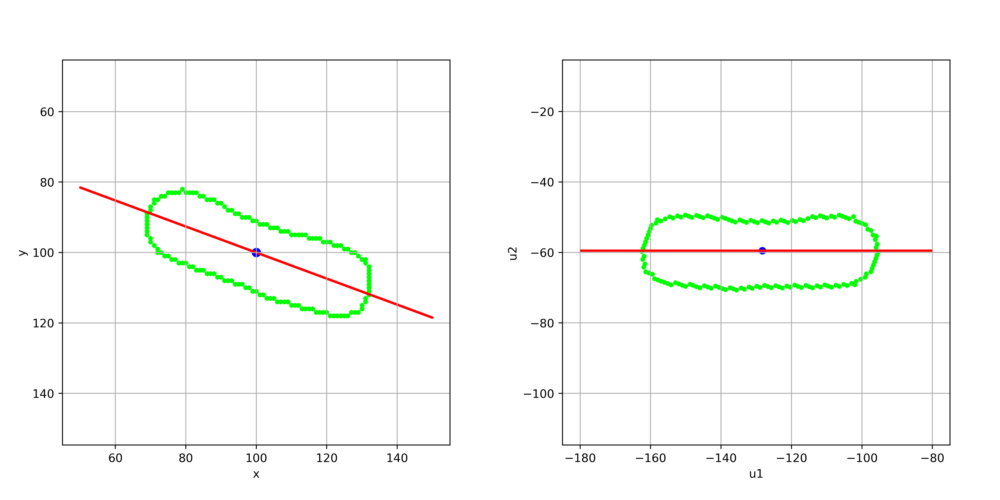  
</div>
<p align="center">
Fig.3  Each coordinate of contour in the new basis (Right). 
</p>


## Cell length calculation Algorithm

### Objective:

To implement an algorithm for calculating the cell length with respect to the center axis of the cell.

### Methodologies:

<i>E.coli</i> expresses filamentous phenotype when exposed to certain chemicals. (e.g. Ciprofloxacin)

Figure 4 shows an example of a filamentous cell with Ciprofloxacin exposure. 

<div align="center">

  

</div>


<p align="center">
Fig.4 A filamentous <i>E.coli</i> cell (PH Left, Fluo-GFP Center, Fluo-mCherry Right).
</p>


Thus, the center axis of the cell, not necessarily straight, is required to calculate the cell length. 

Using the aforementioned basis conversion algorithm, first we converted the basis of the cell contour to its Cov matrix's eigenvectors' basis.

Figure 5 shows the coordinates of the contour in the eigenspace's bases. 


<div align="center">

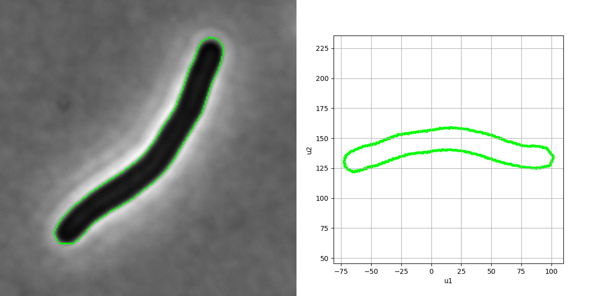  
</div>

<p align="center">
Fig.5 The coordinates of the contour in the new basis (PH Left, contour in the new basis Right).
</p>

We then applied least aquare method to the coordinates of the contour in the new basis.

Let the contour in the new basis

$$\mathbf{C} = \begin{pmatrix}
    u_{1_1} &\cdots&\ u_{1_n} \\ 
    u_{2_1} &\cdots&\ u_{2_n} 
\end{pmatrix} \in \mathbb{R}^{2\times n}$$

then regression with arbitrary k-th degree polynomial (i.e. the center axis of the cell) can be expressed as:
$$f\hat{(u_1)} = \theta^\mathrm{T} \mathbf{U}$$

where 

$$\theta = \begin{pmatrix}
    \theta_k&\cdots&\theta_0
\end{pmatrix}^\mathrm{T}\in \mathbb{R}^{k+1}$$

$$\mathbf{U} = \begin{pmatrix}
    u_1^k&\cdots u_1^0
\end{pmatrix}^\mathrm{T}$$

the parameters in theta can be determined by normal equation:

$$\theta = (\mathbf{W}^\mathrm{T}\mathbf{W})^{-1}\mathbf{W}^\mathrm{T}\mathbf{f}$$

where

$$\mathbf{W} = \begin{pmatrix}
    u_{1_1}^k&\cdots&1 \\
     \vdots&\vdots&\vdots \\
     u_{1_n}^k&\cdots&1 
\end{pmatrix} \in \mathbb{R}^{n\times k +1}$$

$$\mathbf{f} = \begin{pmatrix}
    u_{2_1}&\cdots&u_{2_n}
\end{pmatrix}^\mathrm{T}$$

Hence, we have obtained the parameters in theta for the center axis of the cell in the new basis. (fig. 6)

Now using the axis, the arc length can be calculated as:

$$\mathbf{L} = \int_{u_{1_1}}^{u_{1_2}} \sqrt{1 + (\frac{d}{du_1}\theta^\mathrm{T}\mathbf{U})^2} du_1 $$

**The length is preserved in both bases.**

We rewrite the basis conversion process as:

$$\mathbf{U} = \mathbf{Q}^\mathbf{T} \mathbf{X}$$

The inner product of any vectors in the new basis $\in \mathbb{R}^2$ is 

$$ \|\mathbf{U}\|^2 = \mathbf{U}^\mathrm{T}\mathbf{U} = (\mathbf{Q}^\mathrm{T}\mathbf{X})^\mathrm{T}\mathbf{Q}^\mathbf{T}\mathbf{X} = \mathbf{X}^\mathrm{T}\mathbf{Q}\mathbf{Q}^\mathrm{T}\mathbf{X} \in \mathbb{R}$$

Since $\mathbf{Q}$ is an orthogonal matrix, 

$$\mathbf{Q}^\mathrm{T}\mathbf{Q} = \mathbf{Q}\mathbf{Q}^\mathrm{T} = \mathbf{I}$$

Thus, 

$$\|\mathbf{U}\|^2 = \|\mathbf{X}\|^2$$

Hence <u>the length is preserved in both bases.</u> 


### Result:

Figure 6 shows the center axis of the cell in the new basis (4-th polynominal).


<div align="center">

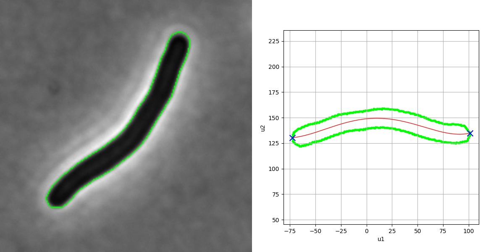  
</div>
<p align="center">
Fig.6 The center axis of the contour in the new basis (PH Left, contour in the new basis with the center axis Right).
</p>

### Choosing the Appropriate K-Value for Polynomial Regression


By default, the K-value is set to 4 in the polynomial regression. However, this may not be sufficient for accurately modeling "wriggling" cells.

For example, Figure 6-1 depicts a cell exhibiting extreme filamentous changes after exposure to Ciprofloxacin. The center axis as modeled does not adequately represent the cell's structure.

<div align="center">

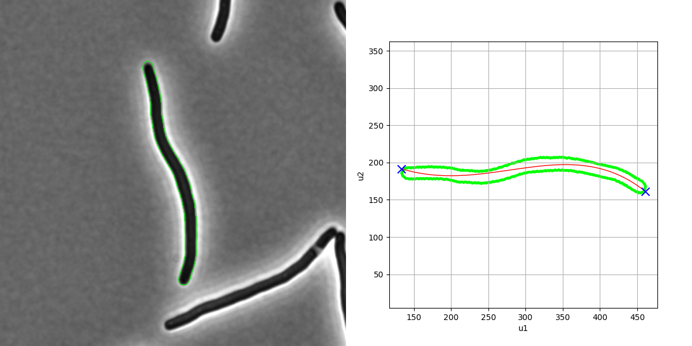  

</div>

<p align="center">
Fig.6-1  An extremely filamentous cell. (PH Left, contour in the new basis with the center axis Right).
</p>


The center axis (in red) with K = 4 does not fit as well as expected, indicating a need to explore higher K-values (i.e., K > 4) for better modeling.

Figure 6-2 demonstrates fit curves (the center axis) for K-values ranging from 5 to 10.


<div align="center">


</div>
<p align="center">
Fig.6-2: Fit curves for the center axis with varying K-values (5 to 10).
</p>

As shown in Fig. 6-2, K = 8 appears to be the optimal value. 

However, it's important to note that the differences in calculated arc lengths across various K-values fall within the subpixel range.

Consequently, choosing K = 4 might remain a viable compromise in any case.


## Quantification of Localization of Fluorescence
### Objective:

To quantify the localization of fluorescence within cells.


### Methodologies:

Quantifying the localization of fluorescence is straightforward in cells with a "straight" morphology(fig. 7-1). 


<div align="center">

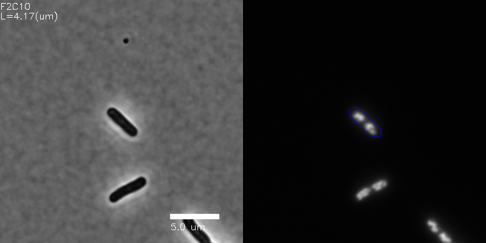  

</div>


<p align="center">
Fig.7-1: An image of an <i>E.coli</i> cell with a straight morphology.
</p>

However, challenges arise with "curved" cells(fig. 7-2).

To address this, we capitalize on our pre-established equation representing the cellular curve (specifically, a quadratic function). 

This equation allows for the precise calculation of the distance between the curve and individual pixels, which is crucial for our quantification approach.

The process begins by calculating the distance between the cellular curve and each pixel. 

This is achieved using the following formula:

An arbitrary point on the curve is described as:
$$(u_1,\theta^\mathrm{T}\mathbf{U}) $$
The minimal distance between this curve and each pixel, denoted as 
$(p_i,q_i)$, is calculated using the distance formula:

$$D_i(u_1) = \sqrt{(u_1-p_i)^2+(f\hat{(u_1)} - q_i)^2}$$

Minimizing $D_i$ with respect to $u_1$ ensures orthogonality between the curve and the line segment joining $(u_1,\theta^\mathrm{T}\mathbf{U})$ and $(p_i,q_i)$ 

This orthogonality condition is satisfied when the derivative of $D_i$ with respect to $u_1$ is zero.

The optimal value of $u_1$, denoted as $u_{1_i}^\star$, is obtained by solving 

$$\frac{d}{du_1}D_i = 0\:\forall i$$

for each pixel  $(p_i,q_i)$. 

Define the set of solution vectors as 
$$\mathbf{U}^\star = \lbrace (u_{1_i}^\star,f\hat{(u_{1_i}^\star)})^\mathrm{T} : u_{1_i}^\star \in u_1 \rbrace \in \mathbb{R}^{2\times n}$$

, where $f\hat{(u_{1_i}^\star)}$ denotes the correspoinding function value.


It should be noted that the vectors in $\mathbf{U}^\star$ can be interpreted as the projections of the pixels $(p_i,q_i)$ onto the curve.

Define the set of projected vectors $\mathbf{P}^\star$ such that each vector in this set consists of the optimal parameter value $u_{1_i}^\star$ and the corresponding fluorescence intensity, denoted by $G(p_i,q_i)$, at the pixel $(p_i,q_i)$. 

$$\mathbf{P}^\star = \lbrace (u_{1_i}^\star,G(p_i,q_i))^\mathrm{T} : u_{1_i}^\star \in u_1 \rbrace \in \mathbb{R}^{2\times n}$$


**Peak Path Finder Algorithm**

Upon deriving the set $\mathbf{P}^\star$, our next objective is to delineate a trajectory that traverses the 'peak' regions of this set. This trajectory is aimed at encapsulating the essential characteristics of each vector in $\mathbf{P}^\star$ while reducing the data complexity. 

To achieve this, we propose an algorithm that identifies critical points along the 'peak' trajectory. 

Initially, we establish a procedure to partition the curve into several segments. Consider the length of each segment to be $\Delta L_i$. The total number of segments, denoted as $n$, is determined by the condition that the sum of the lengths of all segments equals the arc length of the curve between two points $u_{1_1}$ and $u_{1_2}$. 

$$\sum_{i=0}^n \Delta L_i = \int_{u_{1_1}}^{u_{1_2}} \sqrt{1 + (\frac{d}{du_1}\theta^\mathrm{T}\mathbf{U})^2} du_1$$

Utilizing the determined number of segments $n$, we develop an algorithm designed to identify, within each segment $\Delta L_i$, a vector from the set $\mathbf{P}^\star$ that exhibits the maximum value of the function $G(p_i,q_i)$. 

The algorithm proceeds as follows:
        
> $f\to void$<br>
> for $i$ $\in$ $n$:<br>
> &nbsp;&nbsp;&nbsp;&nbsp;Define segment boundaries: $L_i$, $L_{i+1}$<br>
> &nbsp;&nbsp;&nbsp;&nbsp;Initialize: <br>
> &nbsp;&nbsp;&nbsp;&nbsp;&nbsp;&nbsp;&nbsp;&nbsp;maxValue 
> $\leftarrow -\infty$<br>
>  &nbsp;&nbsp;&nbsp;&nbsp;&nbsp;&nbsp;&nbsp;&nbsp;maxVector $\leftarrow \phi$ <br>
> &nbsp;&nbsp;&nbsp;&nbsp;for $\mathbf{v} \in \mathbf{P}^\star$ within $(L_i, L_{i+1})$:<br>
> &nbsp;&nbsp;&nbsp;&nbsp;&nbsp;&nbsp;&nbsp;&nbsp;if $G(p_i, q_i)$ of $\mathbf{v}$ > maxValue:<br>
> &nbsp;&nbsp;&nbsp;&nbsp;&nbsp;&nbsp;&nbsp;&nbsp;&nbsp;&nbsp;&nbsp;&nbsp;maxValue $\leftarrow G(p_i, q_i)$ of $\mathbf{v}$<br>
> &nbsp;&nbsp;&nbsp;&nbsp;&nbsp;&nbsp;&nbsp;&nbsp;&nbsp;&nbsp;&nbsp;&nbsp;maxVector $\leftarrow \mathbf{v}$<br>
> if maxVector $\neq \phi$ :<br>
> &nbsp;&nbsp;&nbsp;&nbsp;Add maxVector to the result set

### Result:
We applied the aforementioned algorithm for the cell shown in figure 7-2.


<div align="center">

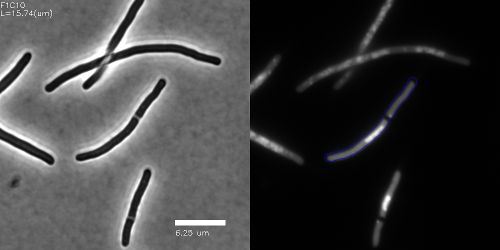  

</div>


<p align="center">
Fig.7-2: An image of a "curved" <i>E.coli</i> cell.
</p>

Figure 7-3 shows all the projected points on the center curve.

<div align="center">

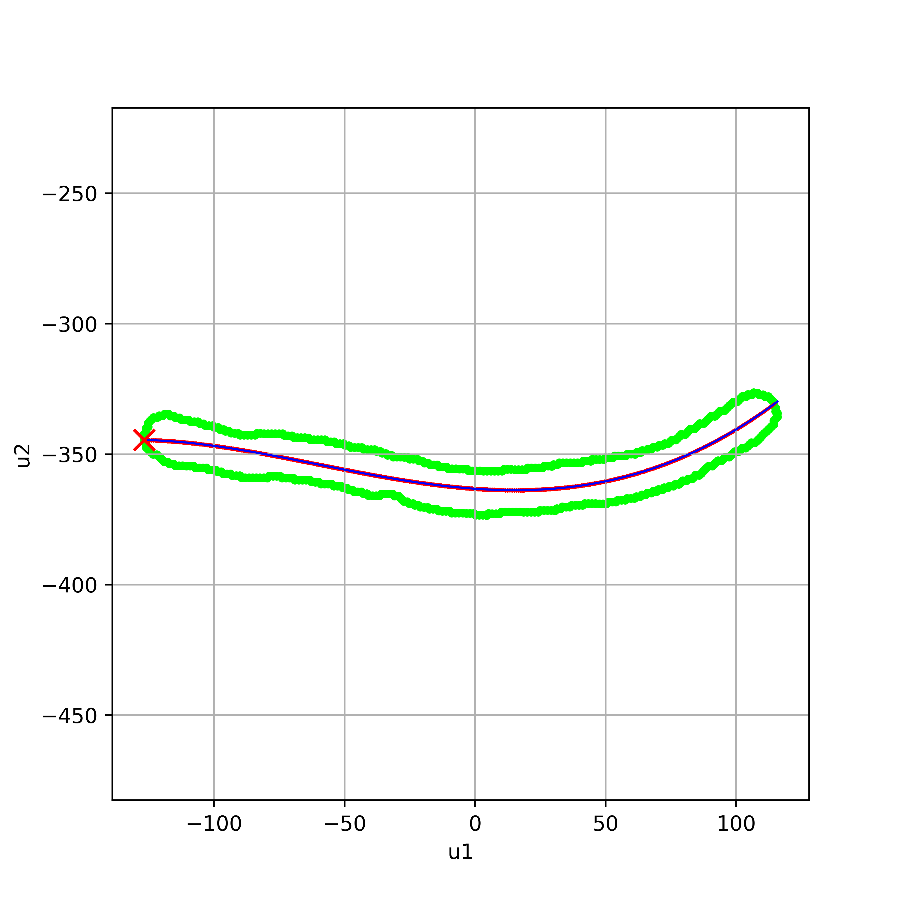  
</div>
<p align="center">
Fig.7-3: All the points(red) projected onto the center curve(blue).
</p>

Figure 7-4 depicts the result of projection onto the curve.

<div align="center">

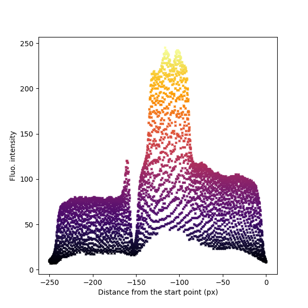  
</div>
<p align="center">
Fig.7-4: Projected points (red) onto the center curve.
</p>


Figure 7-5 describes the result of the peak-path finder algorithm.

<div align="center">

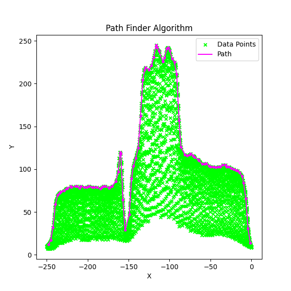
</div>
<p align="center">
Fig.7-5: The estimated peak path by the algorithm.
</p>


# Data analysis

For data analysis, you are welcome to use your original scripts. (We provide how to connect to the database (i.e., *.db) in the different section.) 

However, you can also utilize the default scripts provided to review the cells you have labeled with the application.

The following *E.coli* cell in figure 8-1 is one of the output cells in the directory after running `demo.py`

 **"Cell/ph/"**.

<div align="center">

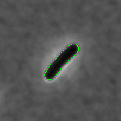  

</div>

<p align="center">
Fig.8-1 A ph image of an <i>E.coli</i> cell.
</p>

## Output Folders/Files

### Cell/ph/
In this directory, the raw image(ph) of each cell with its contour(green) in the arbitrary set square is stored.  (e.g. fig.8-1)

The center of the cell is set to the center of the square.

### Cell/fluo1/

In this directory, the image(fluo1-channel) of each cell in the in the arbitrary set square is stored.

The center of the cell is set to the center of the square.

Figure 8-2 shows the fluo1 image of fig.8-1

<div align="center">

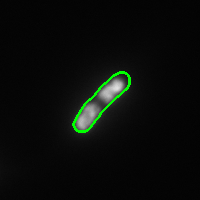  
</div>

<p align="center">
Fig.8-2 A fluo1 image of the <i>E.coli</i> cell in fig.8-1.
</p>

### Cell/fluo2/
In this directory, the same thing as fluo1 is stored for the different channel. 
(only when Dual mode.)

### Cell/fluo1_incide_cell_only/

In this directory, only the cells(fluo1-channel) surrounded by the contour(red in fig.8-2) are stored.

The center of the cell is set to the center of the square.

Figure 8-3 shows areas inside the contour(green, fig.8-2).

<div align="center">

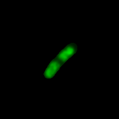  
</div>

<p align="center">
Fig.8-3 Areas surrounded by the contour(green, fig.8-2).
</p>

Pixells are reconstructed in RGB (3 channels, 8bit) and the fluorescent intensity of channels R and B set to 0.

Let the cell coordinates

$$\mathbf{C} = \begin{pmatrix}
    u_{1_1} &\cdots&\ u_{1_n} \\ 
    u_{2_1} &\cdots&\ u_{2_n} 
\end{pmatrix} \in \mathbb{R}^{2\times n}$$

and the fluo. image of the cell

$$
\mathbf{G}\in \mathbb{R}^{i\times{j}}
$$

then the filtering matrix for excluding all the pixells outside the cells is written as: 

$$ \mathbf{W} =  \begin{pmatrix}
  w_{0,0}&\cdots &w_{i,0}\\
  \vdots&\vdots&\vdots\\
  w_{0,j}&\cdots &w_{i,j}\\
\end{pmatrix} \in \mathbb{R}^{i\times{j}}  $$

, where 

$$
w_{i,j} =
    \begin{cases}
            1  &         \text{if } (i,j) \in \mathbf{C} \\
            0  &         \text{if } (i,j) \notin \mathbf{C}
    \end{cases}
$$

Then the fluo. only incide the cell can be expressed as:

$$
\mathbf{G}_{\text{inside}} = \mathbf{W}\otimes\mathbf{G}
$$

### Cell/gradient_magnitudes/

In this directory, each image has the gradient information of the fluorescence intensities inside the cell calculated by the Sobel operator, plotted on the coordinates of the original cell pixels.

The center of the cell is set to the center of the square.

Figure 8-4 shows the plotted gradient information.

<div align="center">

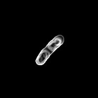  
</div>

<p align="center">
Fig.8-4 Calculated gradient at each pixel inside the cell.
</p>

The kernels for the filtering operator are written as:

$$ \mathbf{K}_i = 
\begin{bmatrix}
-1& 0&+1\\
-2& 0&+2\\
-1& 0&+1\\
\end{bmatrix}$$ 

$$ \mathbf{K}_j = 
\begin{bmatrix}
+1& +2&+1\\
0& 0&0\\
-1& -2&-1\\
\end{bmatrix}$$ 

then the filterd image (i.e., the gradient magnitude image) is written as:

$$ 
\mathbf{G}_{grad}  =  
\sqrt{\mathbf{K}_i \ast \mathbf{G} ^2 + \mathbf{K}_j \ast \mathbf{G} ^2 }
$$

and using this information, the gradient's direction can also be calculated

$$ \Theta  = 
arctan(\mathbf{K}_j \ast \mathbf{G} ,\mathbf{K}_i \ast \mathbf{G}) 
$$

### Cell/histo/
In this directory, histogram of the fluorescence intensities in 256 levels from 0 to 255 for each cell is stored. 

Figure 8-5 shows the histogram for the fluorescence information in fig.8-3.


<div align="center">

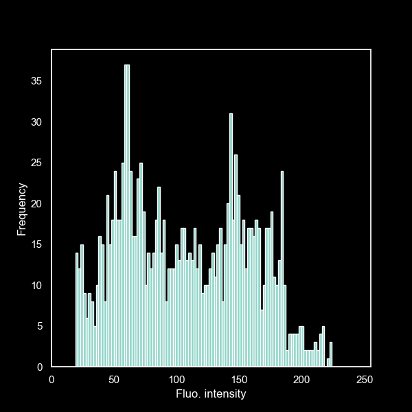  
</div>

<p align="center">
Fig.8-5 Calculated gradient at each pixel inside the cell.
</p>


### Cell/histo_cumulative/


In this directory, a plotted cummulative freqency from Fluo. intensity 0  to 255 for each cell is stored.

Figure 8-6 shows the cumulative frequency plot for the cell.

<div align="center">

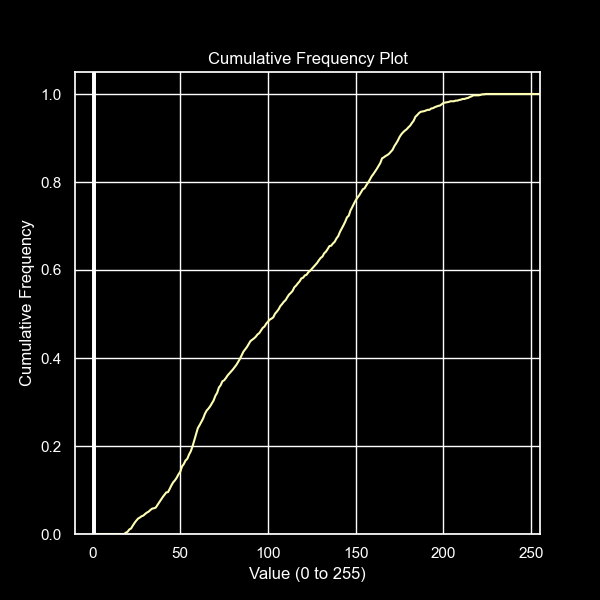  
</div>

<p align="center">
Fig.8-6 Cumulative frequency plot for the cell.
</p>


### Cell/replot/

In this directory, the fluorescence information in each cell normalized between 0 and 1, is stored.
Note that the for the coordinates are in the new basis U.

Figure 8-7 shows the cumulative frequency plot for the cell.

<div align="center">

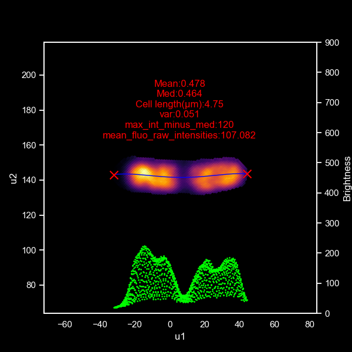  
</div>

<p align="center">
Fig.8-7 Re-plotted fluo. information for the cell. 
</p>

There are also points(in green) that are projected onto the longer axis.
(NOTE that the curvature of the cell axis is not taken account of.)

The fluorescence information is normalized 0 to 1, then plotted with a colormap "inferno" as follows.

<div align="center">

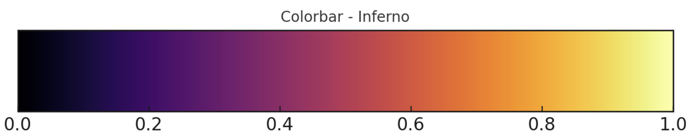  
</div>

### Cell/unified/

In this directory, the combined images (ph and fluo1) are stored. This is for a demonstrating purpose.

Note that the scale bar is 20% of image size (0.0625 µm/pixel)

Figure 8-8 shows the unified image of fig. 8-1 and fig.8-2.

<div align="center">

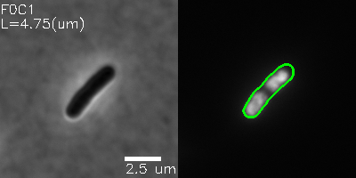  
</div>

<p align="center">
Fig.8-8 The unified image of fig. 8-1 and fig.8-2. 
</p>

### Cell/projected_points/

This directory stores the result of the aforementioned projection algorithm for each cell.

Figure 8-9 shows the result of projection. 
<div align="center">

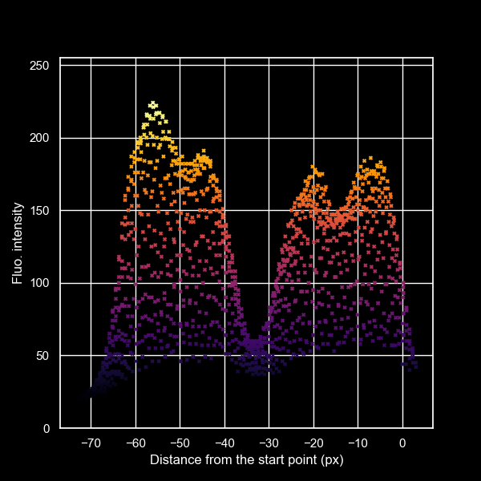  
</div>

<p align="center">
Fig.8-9 The result of projection for the cell in fig.8-1. 
</p>

### Cell/peak_path/

In this directory, the estimated peak path for each cell using the aforementioned algoritm is stored.

Figure 8-10 depicts the estimated peak path for the cell in fig.8-1.

<div align="center">

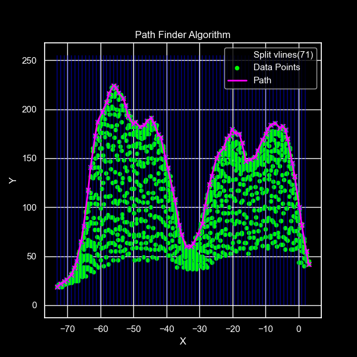  
</div>

<p align="center">
Fig.8-10 The result of the peak path finder algorithm for the cell in fig.8-1. 
</p>


### Cell/3dplot/

This directory contains the 3d plot for each cell. Z-axis represents the fluorescence intensity for each pixel incide the cell.

Figure 8-11 shows the 3d plot of the cell in fig. 8-2.

<div align="center">

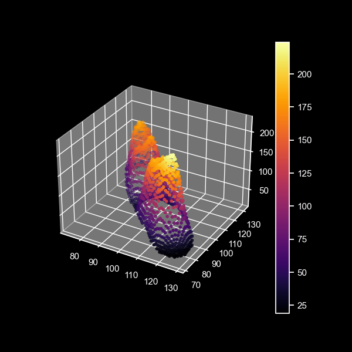  
</div>

<p align="center">
Fig.8-11 The 3d plot of the cell in fig. 8-2
</p>


# Quick Overview of the cells
After running the scripts in "data_analysis" mode, several .png files will be generated in the same directory as "PhenoPixel4.py".

Note that <u>"all" mode automatically includes this process.</u> so that you can directly check the results after running the processes.

In this section, we use "test_database.db" to demonstrate.


You can also run the scripts with the following commands to achieve the same results:

```bash
python demo.py
```

## PH
Displays all raw cells with their contours (in green) in a single image.

<div align="center">

  
</div>

## Fluo
Shows all raw fluorescent cells with their contours in a single image.
<div align="center">

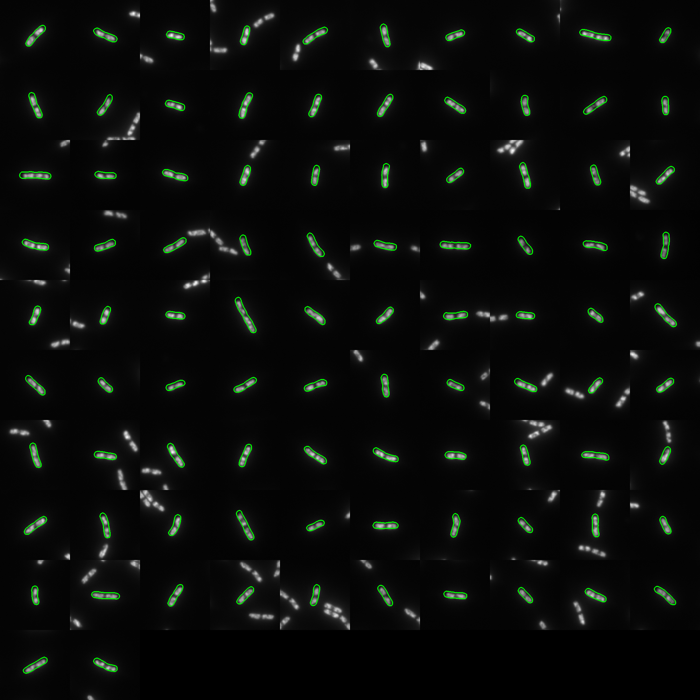  
</div>

## Fluo only incide the cells
Shows all raw fluorescent pixells incide their contours in a single image.

<div align="center">

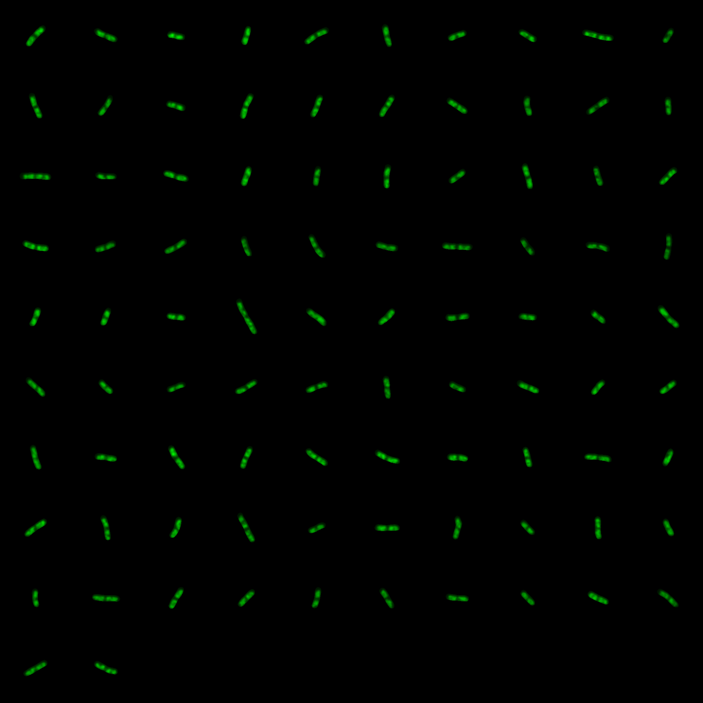  
</div>

## Replot 
Shows all the replot figures in a single image.
<div align="center">

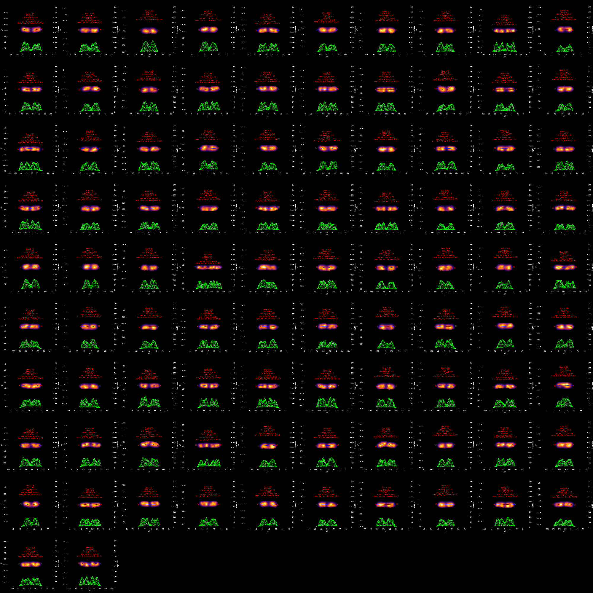  

</div>

## Histo
Shows all the histogram figures in a single image.

<div align="center">

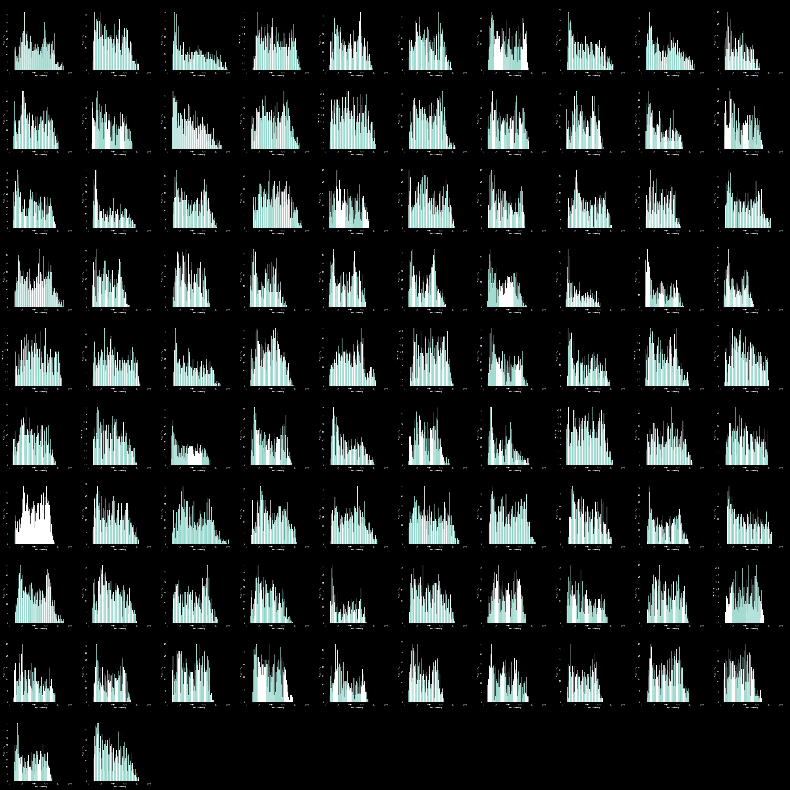  

</div>

## Histo Cumulative
Shows all the cumulative histogram figures in a single image.

<div align="center">

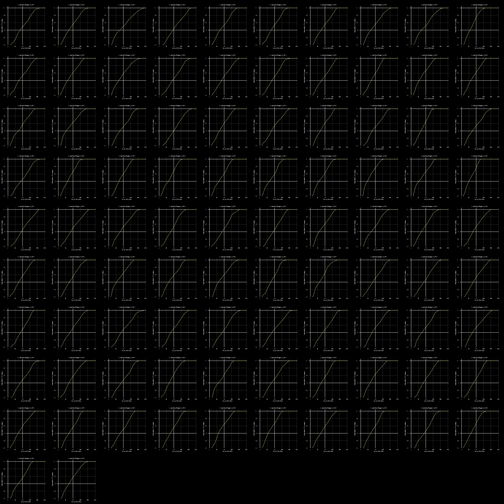  

</div>


## Projected Points
Shows all the figures of the results for projection in a single image.

<div align="center">

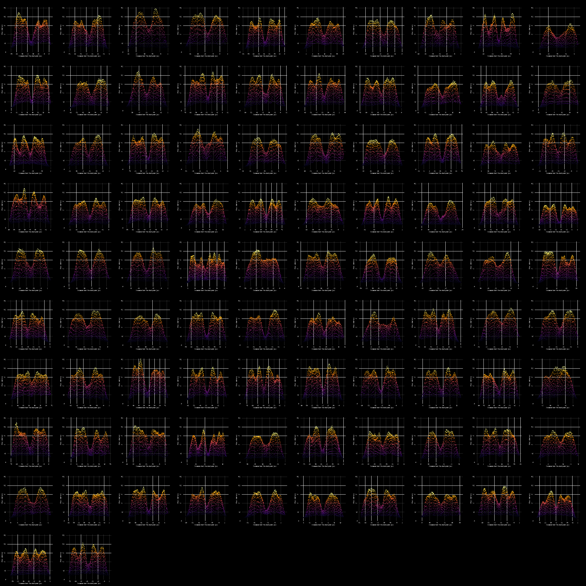  

</div>

## Peak paths
Shows all the figures of the estimated peak paths in a single image.

<div align="center">

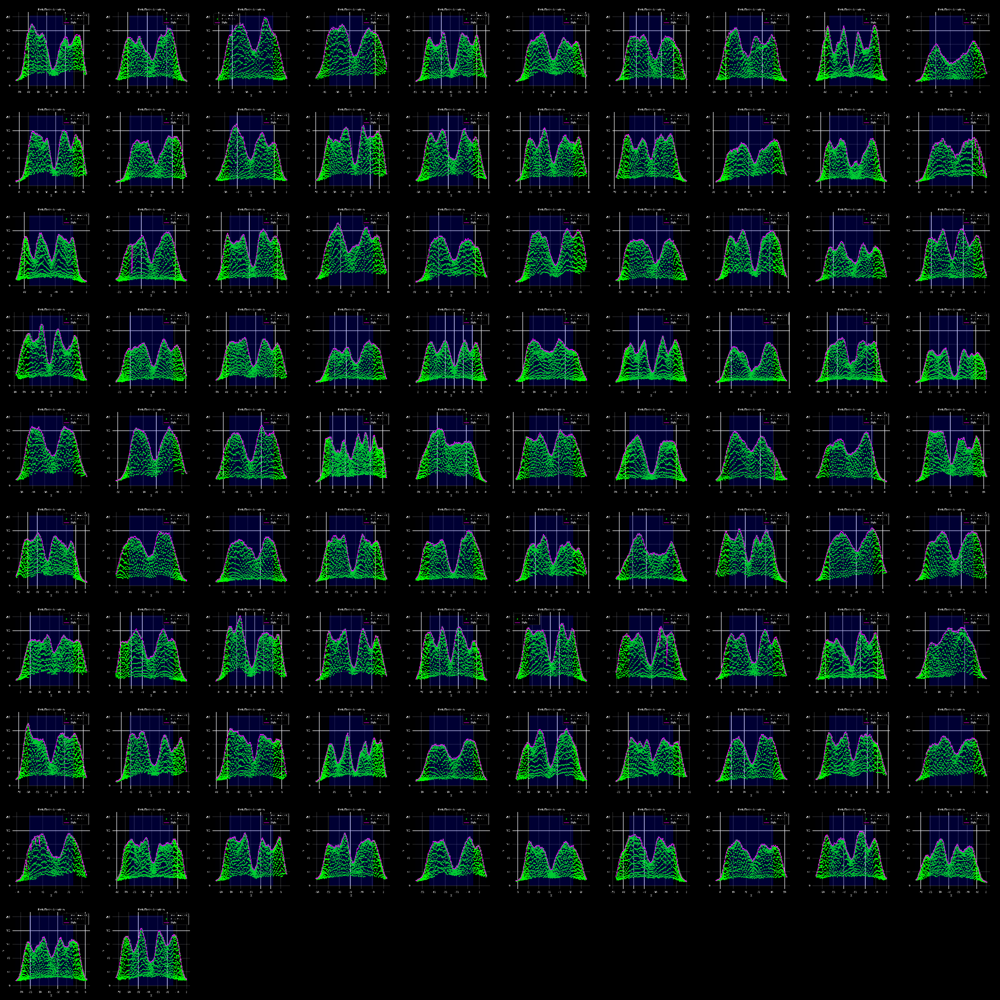  

</div>


# Data analyses scripts

## localization heatmap
Utilizing the estimated peak paths for each cell, we can visualize the localization of fluorescence within the cells in a single figure.

This section utilizes `test_database.db` and `demo.py` for demonstration purposes.


After executing `demo.py`, the file `app/test_database_peak_points_ys.txt` is generated.

Since the x-axis (representing the relative position in the cell) is uniformly divided, our focus is primarily on the points of brightness.

We generate a figure that consolidates all the obtained peak paths using the following code:

```python
import numpy as np
import matplotlib.pyplot as plt
from matplotlib import gridspec


class HeatmapVector:
    def __init__(self, heatmap_vector: np.ndarray, sample_num: int):
        self.heatmap_vector: np.ndarray = heatmap_vector
        self.sample_num: int = sample_num

    def __gt__(self, other):
        self_v = np.sum(self.heatmap_vector)
        other_v = np.sum(other.heatmap_vector)
        return self_v < other_v


def get_heatmap_vector(file: str):
    with open(file, "r") as f:
        ys = [
            [float(x.replace("\n", "")) for x in line.split(",")]
            for line in f.readlines()
        ]
        ys_normalized = []
        for i in ys:
            i = np.array(i)
            i = (i - i.min()) / (i.max() - i.min())
            ys_normalized.append(i.tolist())
    return ys_normalized


def create_heatmap(files: list[str]) -> None:
    vectors = []
    for i, file in enumerate(files):
        vectors += sorted([HeatmapVector(j, i) for j in get_heatmap_vector(file)])

    concatenated_samples = np.column_stack([i.heatmap_vector for i in vectors])

    plt.figure(figsize=(10, 10))
    gs = gridspec.GridSpec(
        2, 2, width_ratios=[30, 1], height_ratios=[1, 10], hspace=0.05, wspace=0.05
    )
    additional_row = np.array([i.sample_num / 4 for i in vectors])[None, :]
    plt.figure(figsize=(10, 6))
    gs = gridspec.GridSpec(
        2, 2, width_ratios=[30, 1], height_ratios=[1, 10], hspace=0.05, wspace=0.05
    )

    ax0 = plt.subplot(gs[0, 0])
    ax0.imshow(
        additional_row,
        aspect="auto",
        cmap="inferno",
        extent=[0, concatenated_samples.shape[1], 0, 1],
    )
    ax0.set_xticks([])
    ax0.set_yticks([])

    ax1 = plt.subplot(gs[1, 0])
    im = ax1.imshow(concatenated_samples, aspect="auto", cmap="inferno")
    ax1.set_xlabel(f"Sample Number")
    ax1.set_ylabel("Split index (Relative position)")
    ax2 = plt.subplot(gs[:, 1])
    plt.colorbar(im, cax=ax2)
    ax2.set_ylabel("Normalized fluo. intensity", rotation=270, labelpad=15)
    plt.savefig("heatmap.png")


## Edit here
file1 = "file2.txt"
file2 = "file1.txt"
files = [file1, file2]

create_heatmap(files)
```

With the codes, we obtain a heatmap as shown in figure 9-1.

<div align="center">

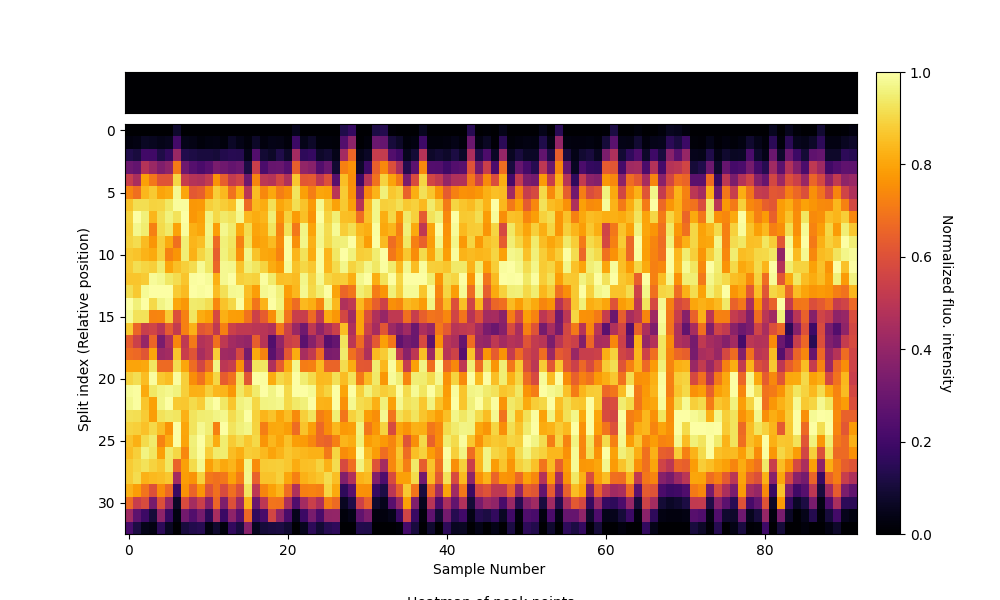  
</div>

<p align="center">
Fig.9-1 The heatmap of the fluo. localization of the cells. (Sorted by the definition in the codes.) 
</p>

## Overlay the peak paths
You can overlay all the peak paths you have obtained in a single figure with the following scripts.

```python
import numpy as np
import matplotlib.pyplot as plt

## Edit here
file = "app/test_database_peak_points_ys.txt"

with open(file, "r") as f:
    ys = [
        [float(x.replace("\n", "")) for x in line.split(",")] for line in f.readlines()
    ]
    ys_normalized = []
    for i in ys:
        i = np.array(i)
        i = (i - i.min()) / (i.max() - i.min())
        ys_normalized.append(i.tolist())

plt.figure(figsize=(10, 7))
for i in ys_normalized:
    plt.plot(i, linewidth=0.5,color = "red",alpha = 0.5)
plt.grid()
plt.ylabel("Normalized Intensity")
plt.xlabel("Relative position")
plt.savefig("overlay.png")
```

Figure 9-2 shows the result of executing the scripts.

<div align="center">

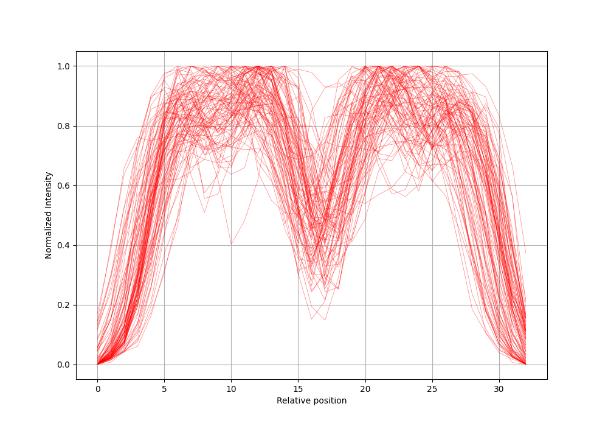  
</div>

<p align="center">
Fig.9-2 The overlay plot of all the peak paths.
</p>

## Box plot
Here is a template for generating a box plot figure. 
```Python
import seaborn as sns
import matplotlib.pyplot as plt
import numpy as np
sns.set()

def box_plot_function(data:list[np.ndarray] | list[float|int], 
                      labels:list[str], 
                      xlabel:str, 
                      ylabel:str, 
                      save_name:str) -> None:
    fig = plt.figure(figsize=[10,7])
    plt.boxplot(data,sym="")
    for i, d in enumerate(data, start=1):
        x = np.random.normal(i, 0.04, size=len(d)) 
        plt.plot(x, d, 'o', alpha=0.5)  
    plt.xticks([i+1 for i in range(len(data))], [f"{i}" for i in labels])
    plt.xlabel(xlabel)
    plt.ylabel(ylabel)
    plt.grid(True)
    fig.savefig(f"{save_name}.png",dpi = 500)


data1 = np.random.normal(0, 1, size=100)
data2 = np.random.normal(0, 2, size=100)
data3 = np.random.normal(0, 3, size=100)

data  = [data1, data2, data3]
labels = ["data1", "data2", "data3"]
xlabel = "Samples"
ylabel = "Lengths (pixel)"
save_name = "result"
box_plot_function(data, labels, xlabel, ylabel, save_name)
```
Figure 9-3 shows the result of executing the scripts.

<div align="center">

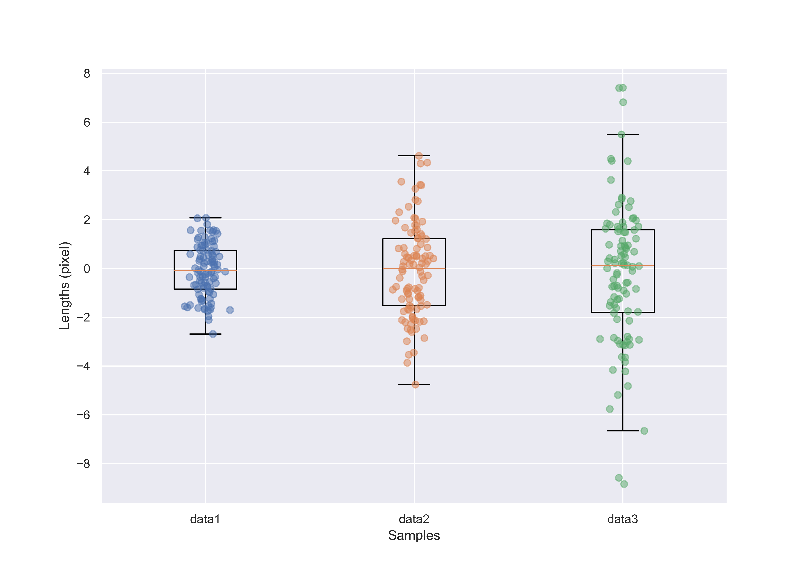  
</div>

<p align="center">
Fig.9-3 A box plot figure of randomly generated data points for three series.
</p>

# License
[OpenCV License](https://github.com/opencv/opencv/blob/master/LICENSE)


# Contributors 

Haruya Tsurusako (e3131901@foreign.kitakyu-u.ac.jp)


