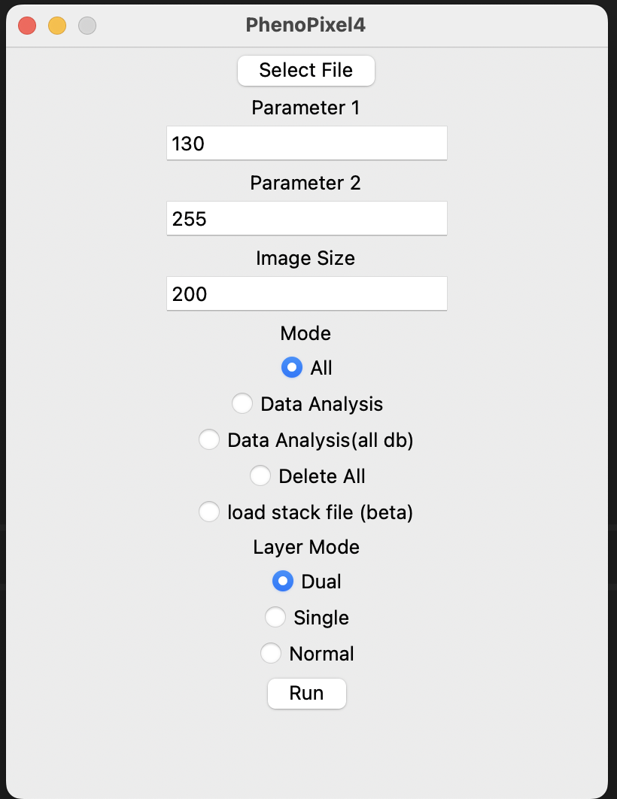

# PhenoPixel4.0

<div align="center">


</div>
PhenoPixel4.0 is an OpenCV-based image processing program designed for automating the extraction of cell images from a large number of images (e.g., multiple nd2 files). 


<div align="center">


</div>

It is also capable of detecting the contours of cells manually as shown so that all the phenotypic cells can be equally sampled.

This program is Python-based and utilizes Tkinter for its GUI, making it cross-platform, and has been primarily tested on Windows 11 and MacOS Sonoma 14.0.

# Installation & Setup
1. Install `python 3.8` or higher on your computer.
2. Clone this repository to your computer. (e.g., on visual studio code)
```bash
https://github.com/ikeda042/PhenoPixel4.0.git
```
3. Install the required packages with the following commmand in the root directory of the repository.
```bash
pip install -r app/requirements.txt
```

# Usage
1. Go to the root directory and run `PhenoPixel4.py`
```bash
python PhenoPixel4.py
```
After running the scripts, the landing window automatically pops up. 



2. Click "Select File" to choose a file. (file ext must be .nd2/.tif)
   

Input parameters are listed below.

| Parameters | Type | Description |
| :---: | :---: | :--- |
| Parameter 1 | int [0-255] | Lower threshold for Canny algorithm.|
| Parameter 2 | int [0-255] | Higher threshold for Canny algorithm.|
|Image Size | int | Size for square for each cell.|
|Mode| Literal | `all` for general analysis including cell extraction, `Data Analysis` for only data analysis using existing database(.db),  `Data Analysis(all db)` for sequentially read all the databases in the root directly, and `Delete All` to clear unused files.|
|Layer Mode|Literal|Dual(PH,Fluo1,Fluo2)/Single(PH)/Normal(PH,Fluo1)|

For exmaple, if you have an nd2 file structured like PH_0, Fluo_0, PH_1, Fluo_1..., `Normal` Mode works the best.

3. Click "Run" to start the program.
4. Image labeling application window pops up when done with cell extraction.
5. Choose arbitrary label for each and press "Submit" or simply press Return key. (Default value is set to N/A) You can use the label later to analyse cells. (e.g., only picking up cells with label 1)

6. Close the window when reached the last cell, then database will automatically be created.

# Database
## image_labels.db

Each row has the following columns:

| Column Name | Data Type | Description                   |
|-------------|-----------|-------------------------------|
| id          | int       | Unique ID                     |
| image_id    | str       | Cell id                       |
| label       | str       | Label data manually chosen    |

## filename.db
| Column Name      | Data Type      | Description                                         |
|------------------|----------------|-----------------------------------------------------|
| id               | int            | Unique ID                                           |
| cell_id          | str            | Cell id (Frame n Cell n)                            |
| label_experiment | str \| Null    | Experimental label (e.g., Series1 exposure30min)    |
| manual_label     | str \| Null    | Label data from image_labels.db with respect to cell ID |
| perimeter        | float          | Perimeter                                           |
| area             | float          | Area                                                |
| image_ph         | BLOB           | PH image in Square block (image size x image size)  |
| image_flup1      | BLOB \| Null   | Fluo 1 image                                        |
| image_flup2      | BLOB \| Null   | Fluo 2 image                                        |
| contour          | BLOB           | 2D array cell contour                               |


