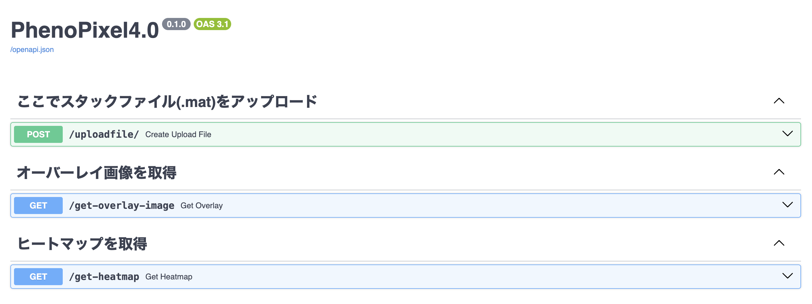
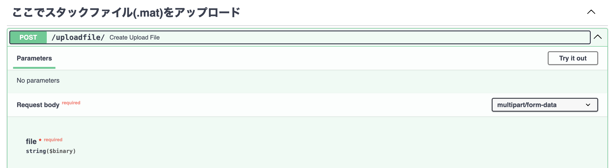
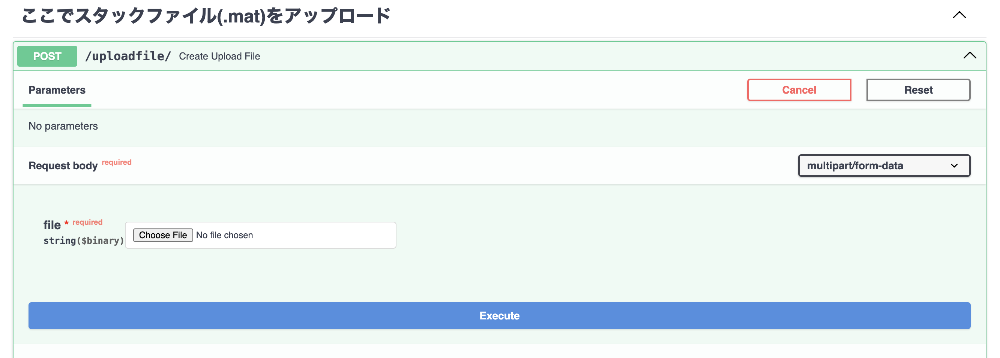
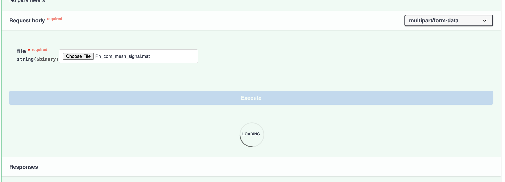
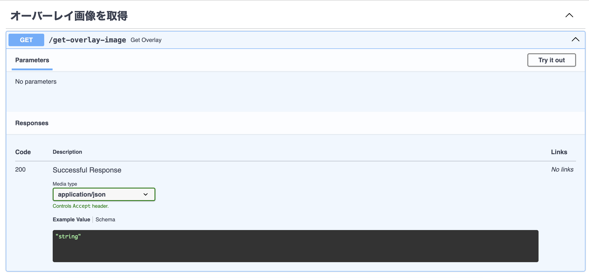
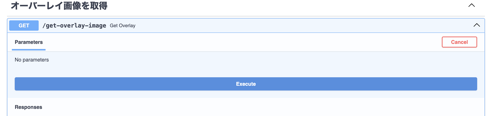
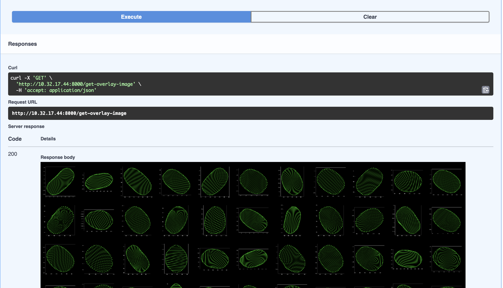
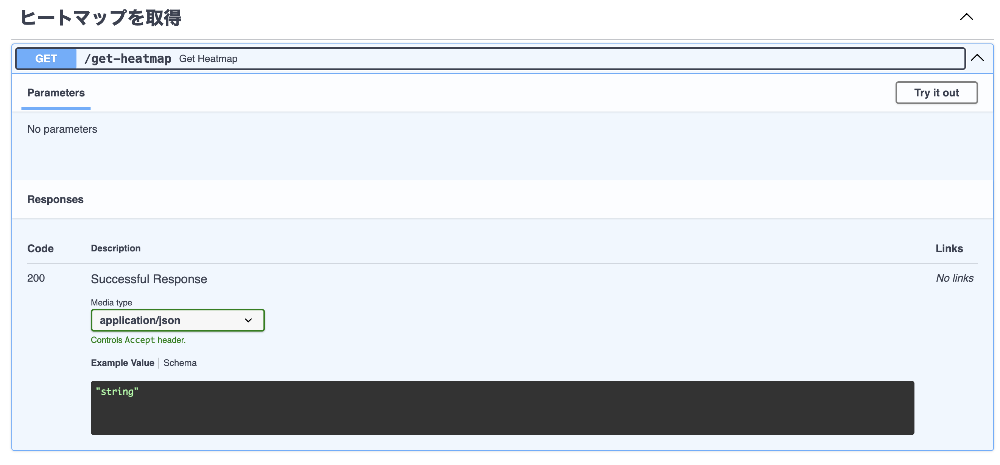
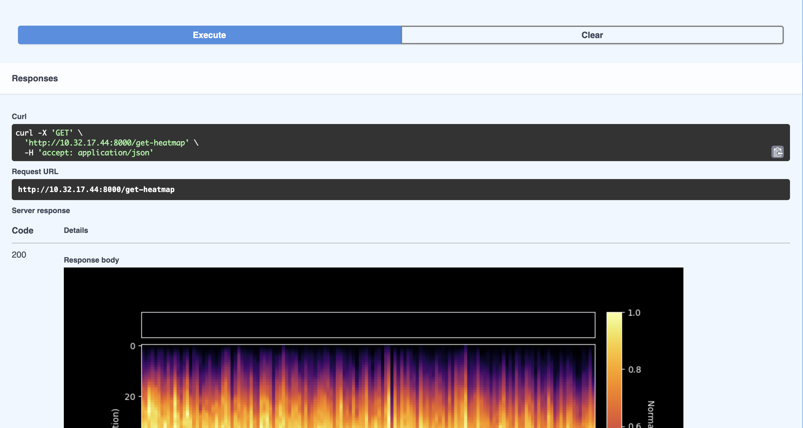

# Matlabデータから細胞情報を定性的に確認する方法

## 以下のURLにアクセスする
<a>http://10.32.17.44:8000/phenopixel4.0</a>

(研究室のMolbio5Gに接続していないとアクセスがブロックされる。)

## アプリケーショントップページ

## スタックファイルをアップロードする
1. 緑色の一番上のバーをクリックすると以下のような画面になる。ここで、 右端の`Try it out`をクリックする。

2. ファイルを選択してexecuteを押す。
   この時、　Loadingが終了するまで待つ。（10秒くらい）
   

3. Loadingが終わったら、スタックファイルのアップロード、読み込みが完了。

## 解析結果を確認する
1. 以下の青色のバーをクリックし、アップロード時と同様に右端の`Try it out`をクリックする。

2. 青色のExecuteを押す。

3. スタックファイルに含まれるすべての細胞を一枚にまとめた画像が返ってくる。(右クリックで保存可能)

## 蛍光局在ヒートマップを取得する
1. 以下の青色のバーをクリックし、アップロード時と同様に右端の`Try it out`をクリックする。

2. 青色のExecuteを押すと、蛍光局在ヒートマップが返ってくる。(右クリックで保存可能)

   

   

